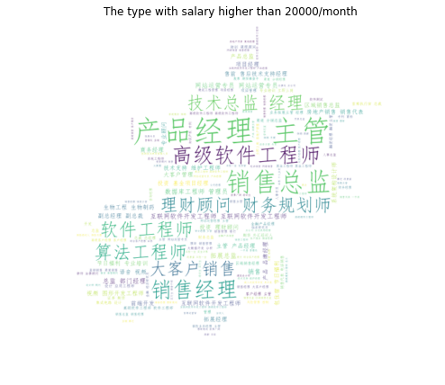
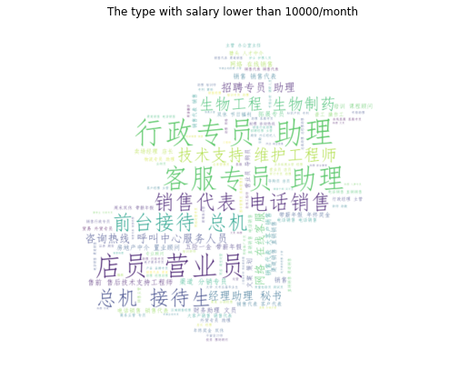
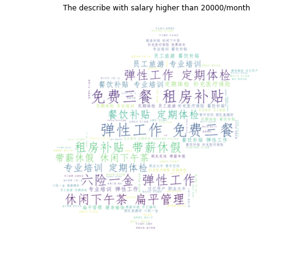
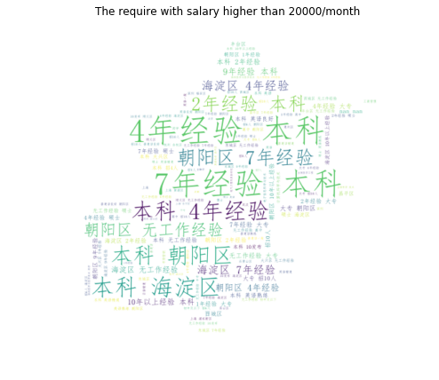
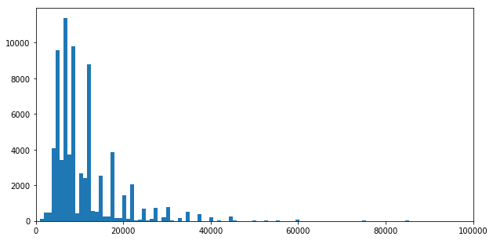
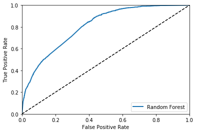

# Data prepare


```python
import pandas as pd
import numpy as np
import re
```

#### Read data and drop item withou salary


```python
f=open("C:/Users/Leo/Documents/github_repositories/scrapy_foundamental/job_china/job1.csv")
df=pd.read_csv(f)
df["job"]=df.index
df.columns=[ 'Campany', 'Salary', 'Work_Position', 'Post_time',
       'Require', 'Describe',"type",'job']
# relapce nan
df=df.replace('[]',np.nan)
# drop duplicate item
df.drop_duplicates(inplace=True)
# drop items witout salary
df.drop(df[df['Salary'].isnull()].index.tolist(),inplace=True)
# re range the index
df.index=range(len(df))
```


```python
df.head(3)
```


<div>
<style scoped>
    .dataframe tbody tr th:only-of-type {
        vertical-align: middle;
    }

    .dataframe tbody tr th {
        vertical-align: top;
    }

    .dataframe thead th {
        text-align: right;
    }
</style>
<table border="1" class="dataframe">
  <thead>
    <tr style="text-align: right;">
      <th></th>
      <th>Campany</th>
      <th>Salary</th>
      <th>Work_Position</th>
      <th>Post_time</th>
      <th>Require</th>
      <th>Describe</th>
      <th>type</th>
      <th>job</th>
    </tr>
  </thead>
  <tbody>
    <tr>
      <th>0</th>
      <td>翼集分电子商务（上海）有限公司</td>
      <td>15-20万/年</td>
      <td>北京-西城区</td>
      <td>01-12</td>
      <td>['北京-西城区\xa0\xa0|\xa0\xa03-4年经验\xa0\xa0|\xa0\x...</td>
      <td>['五险一金', '补充公积金', '定期体检', '餐饮补贴', '绩效奖金', '年终奖...</td>
      <td>['\r\n\t\t\t\t\t\t\t\t\t\t市场/营销/拓展主管\t\t\t\t\t...</td>
      <td>方案经理</td>
    </tr>
    <tr>
      <th>1</th>
      <td>Hewlett Packard Enterprise</td>
      <td>1.5-2.5万/月</td>
      <td>北京-朝阳区</td>
      <td>01-12</td>
      <td>['北京-朝阳区\xa0\xa0|\xa0\xa0无工作经验\xa0\xa0|\xa0\xa...</td>
      <td>NaN</td>
      <td>['\r\n\t\t\t\t\t\t\t\t\t\t高级软件工程师\t\t\t\t\t\t\...</td>
      <td>高级软件工程师 - Software Development Engineer</td>
    </tr>
    <tr>
      <th>2</th>
      <td>英达特信息技术（上海）有限公司</td>
      <td>1-1.8万/月</td>
      <td>北京-朝阳区</td>
      <td>01-12</td>
      <td>['北京-朝阳区\xa0\xa0|\xa0\xa03-4年经验\xa0\xa0|\xa0\x...</td>
      <td>['补充医疗保险', '五险一金', '员工旅游', '交通补贴', '通讯补贴', '绩效...</td>
      <td>['\r\n\t\t\t\t\t\t\t\t\t\t大客户销售\t\t\t\t\t\t\t\...</td>
      <td>Business Development Manager of North China</td>
    </tr>
  </tbody>
</table>
</div>


```python
df.info()
```

    <class 'pandas.core.frame.DataFrame'>
    RangeIndex: 74660 entries, 0 to 74659
    Data columns (total 8 columns):
    Campany          74660 non-null object
    Salary           74660 non-null object
    Work_Position    74660 non-null object
    Post_time        74660 non-null object
    Require          73267 non-null object
    Describe         61691 non-null object
    type             73267 non-null object
    job              74660 non-null object
    dtypes: object(8)
    memory usage: 4.6+ MB
    

#### 51788 different jobs founded


```python
df["job"].value_counts().describe()
```


    count    51788.000000
    mean         1.441647
    std          3.262597
    min          1.000000
    25%          1.000000
    50%          1.000000
    75%          1.000000
    max        241.000000
    Name: job, dtype: float64


### dealing with salary first


```python
salary_first=df["Salary"].str.split('/',expand=True)[0].str.split('-',expand=True)[0]
salary_last=df["Salary"].str.split('/',expand=True)[0].str.split('-',expand=True)[1]
```


```python
def is_number(num):
    try: 
        float(num)
        return float(num)
    except ValueError: 
        return np.nan
```

#### Extract useful information to compute monthly salary


```python
df["salary_first"]=[is_number(x) for x in salary_first]
df["salary_second"]=[is_number(re.findall(u"[^\u4e00-\u9fa5]+",x)[0]) if x else x for x in salary_last]
df["salary_unit"]=[re.findall(u"[\u4e00-\u9fa5]+",x)[0] if x else x for x in salary_last]
df["salary_time"]=df["Salary"].str.split('/',expand=True)[1]
```


```python
df["salary_unit"].value_counts()
```


    万    44044
    千    29895
    Name: salary_unit, dtype: int64


```python
df["salary_unit"]=df["salary_unit"].replace("万",10000)
df["salary_unit"]=df["salary_unit"].replace("千",1000)
```


```python
df["salary_time"].value_counts()
```


    月     71525
    年      2509
    天       504
    小时      122
    Name: salary_time, dtype: int64


#### compute work_time into same scale, month


```python
df["salary_time"]=df["salary_time"].replace("月",1)
df["salary_time"]=df["salary_time"].replace("年",0.083)
df["salary_time"]=df["salary_time"].replace("天",30)
df["salary_time"]=df["salary_time"].replace("小时",240)
```

#### Drop the items without useful infomations


```python
df.drop(df[df['salary_first'].isnull()].index.tolist(),inplace=True)
df.index=range(len(df))
df.drop(df[df['salary_time'].isnull()].index.tolist(),inplace=True)
df.index=range(len(df))
```

#### Compute salary


```python
df["salary_low"]=df["salary_first"]*df["salary_unit"]*df["salary_time"]
df["salary_high"]=df["salary_second"]*df["salary_unit"]*df["salary_time"]
df["salary_mean"]=(df["salary_low"]+df["salary_high"])/2
```

#### Drop original mass columns


```python
df=df.drop(["Salary","salary_first","salary_second","salary_unit","salary_time"],axis=1)
```


```python
df["salary_variance"]=df["salary_high"]-df["salary_low"]
```


```python
df.head(2)
```


<div>
<style scoped>
    .dataframe tbody tr th:only-of-type {
        vertical-align: middle;
    }

    .dataframe tbody tr th {
        vertical-align: top;
    }

    .dataframe thead th {
        text-align: right;
    }
</style>
<table border="1" class="dataframe">
  <thead>
    <tr style="text-align: right;">
      <th></th>
      <th>Campany</th>
      <th>Work_Position</th>
      <th>Post_time</th>
      <th>Require</th>
      <th>Describe</th>
      <th>type</th>
      <th>job</th>
      <th>salary_low</th>
      <th>salary_high</th>
      <th>salary_mean</th>
      <th>salary_variance</th>
    </tr>
  </thead>
  <tbody>
    <tr>
      <th>0</th>
      <td>翼集分电子商务（上海）有限公司</td>
      <td>北京-西城区</td>
      <td>01-12</td>
      <td>['北京-西城区\xa0\xa0|\xa0\xa03-4年经验\xa0\xa0|\xa0\x...</td>
      <td>['五险一金', '补充公积金', '定期体检', '餐饮补贴', '绩效奖金', '年终奖...</td>
      <td>['\r\n\t\t\t\t\t\t\t\t\t\t市场/营销/拓展主管\t\t\t\t\t...</td>
      <td>方案经理</td>
      <td>12450.0</td>
      <td>16600.0</td>
      <td>14525.0</td>
      <td>4150.0</td>
    </tr>
    <tr>
      <th>1</th>
      <td>Hewlett Packard Enterprise</td>
      <td>北京-朝阳区</td>
      <td>01-12</td>
      <td>['北京-朝阳区\xa0\xa0|\xa0\xa0无工作经验\xa0\xa0|\xa0\xa...</td>
      <td>NaN</td>
      <td>['\r\n\t\t\t\t\t\t\t\t\t\t高级软件工程师\t\t\t\t\t\t\...</td>
      <td>高级软件工程师 - Software Development Engineer</td>
      <td>15000.0</td>
      <td>25000.0</td>
      <td>20000.0</td>
      <td>10000.0</td>
    </tr>
  </tbody>
</table>
</div>


# Dealing with Require, describe and type

#### extract useful infomation


```python
type_list=",".join([",".join(re.findall(u"[\u4e00-\u9fa5]+",str(x))) 
                    for x in df["type"].tolist()]).split(",")
```


```python
type_list[:5]
```


    ['市场', '营销', '拓展主管', '高级软件工程师', '无线通信工程师']


```python
describe_list=",".join([x.strip().strip("'").strip() 
                        for x in ",".join([str(x).lstrip('[').rstrip(']') 
                                                                        for x in df["Describe"].tolist()]).split(",")]).split(",")
```


```python
describe_list[:5]
```


    ['五险一金', '补充公积金', '定期体检', '餐饮补贴', '绩效奖金']


```python
require_list=",".join([",".join(str(x).lstrip("['").rstrip("']").split("\\xa0\\xa0|\\xa0\\xa0")) for x in df["Require"].tolist()]).split(",")
```


```python
require_list[:5]
```


    ['北京-西城区', '3-4年经验', '本科', '招1人', '01-12发布']


# picture of word

#### Get the words picture for different groups job


```python
from wordcloud import WordCloud
```


```python
import matplotlib.pyplot as plt  
from wordcloud import WordCloud,STOPWORDS,ImageColorGenerator
%pylab inline
```

    Populating the interactive namespace from numpy and matplotlib
    

    C:\Software\Anaconda3\lib\site-packages\IPython\core\magics\pylab.py:160: UserWarning: pylab import has clobbered these variables: ['f']
    `%matplotlib` prevents importing * from pylab and numpy
      "\n`%matplotlib` prevents importing * from pylab and numpy"
    

#### Make picture can output Chinese


```python
from PIL import Image
picture = np.array(Image.open("beijing.png"))
```


```python
font = r'simfang.ttf'
```

### Work type words picture by different salary group job

#### Delete the words ofen occurs in both groups


```python
stopwords = set(STOPWORDS)
stopwords.add("其他")
stopwords.add("市场")
stopwords.add("营销")
```


```python
type_txt_high=",".join([",".join(re.findall(u"[\u4e00-\u9fa5]+",str(x))) 
                        for x in df[df["salary_mean"]>20000]["type"].tolist()])

type_txt_low=",".join([",".join(re.findall(u"[\u4e00-\u9fa5]+",str(x))) 
                       for x in df[df["salary_mean"]<=10000]["type"].tolist()])
```


```python
wordcloud_high = WordCloud(font_path=font,stopwords=stopwords,
                     mask=picture,max_words=200,max_font_size=80,
                      background_color='white',random_state=42,
                     width=3000,height=2000,).generate(type_txt_high)
```


```python
wordcloud_low = WordCloud(font_path=font,stopwords=stopwords,
                     mask=picture,max_words=200,max_font_size=80,
                      background_color='white',random_state=42,
                     width=3000,height=2000,).generate(type_txt_low)
```


```python
plt.figure(figsize=(8,8))
plt.imshow(wordcloud_high, interpolation='bilinear')
plt.title("The type with salary higher than 20000/month")
plt.axis("off")
plt.savefig("Type_high.png")
```





```python
plt.figure(figsize=(8,8))
plt.imshow(wordcloud_low, interpolation='bilinear')
plt.title("The type with salary lower than 10000/month")
plt.axis("off")
plt.savefig("Type_low.png")
```





#### Work description's words picture by different salary group job


```python
stopwords = set(STOPWORDS)
stopwords.add("nan")
stopwords.add("五险一金")
stopwords.add("交通补贴")
stopwords.add("年终奖金")
stopwords.add("绩效奖金")
stopwords.add("通讯补贴")
```


```python
describe_txt_high=",".join([x.strip().strip("'").strip() 
                            for x in ",".join([str(x).lstrip('[').rstrip(']') for x in df[df["salary_mean"]>20000]["Describe"].tolist()]).split(",")])

describe_txt_low=",".join([x.strip().strip("'").strip() 
                           for x in ",".join([str(x).lstrip('[').rstrip(']') for x in df[df["salary_mean"]<=10000]["Describe"].tolist()]).split(",")])
```


```python
describe_high_word = WordCloud(font_path=font,stopwords=stopwords,
                     mask=picture,max_words=200,max_font_size=80,
                      background_color='white',random_state=42,
                     width=3000,height=2000,).generate(describe_txt_high)
```


```python
describe_low_word = WordCloud(font_path=font,stopwords=stopwords,
                     mask=picture,max_words=200,max_font_size=80,
                      background_color='white',random_state=42,
                     width=3000,height=2000,).generate(describe_txt_low)
```


```python
plt.figure(figsize=(8,8))
plt.imshow(describe_high_word, interpolation='bilinear')
plt.title("The describe with salary higher than 20000/month")
plt.axis("off")
plt.savefig("Describe_high.png")
```





```python
plt.figure(figsize=(8,8))
plt.imshow(describe_low_word, interpolation='bilinear')
plt.title("The describe with salary lower than 1000/month")
plt.axis("off")
plt.savefig("Describe_low.png")
```


#### require


```python
stopwords = set(STOPWORDS)
stopwords.add("招1人")
stopwords.add("招2人")
stopwords.add("招3人")
stopwords.add("招5人")
stopwords.add("招若干人")
stopwords.add("12发布")
stopwords.add("11发布")
stopwords.add("北京")
```


```python
require_txt_high=",".join([",".join(str(x).lstrip("['").rstrip("']").split("\\xa0\\xa0|\\xa0\\xa0")) 
                           for x in df[df["salary_mean"]>20000]["Require"].tolist()])

require_txt_low=",".join([",".join(str(x).lstrip("['").rstrip("']").split("\\xa0\\xa0|\\xa0\\xa0")) 
                           for x in df[df["salary_mean"]<=10000]["Require"].tolist()])
```


```python
require_high_word = WordCloud(font_path=font,stopwords=stopwords,
                     mask=picture,max_words=200,max_font_size=80,
                      background_color='white',random_state=42,
                     width=3000,height=2000,).generate(require_txt_high)
```


```python
require_low_word = WordCloud(font_path=font,stopwords=stopwords,
                     mask=picture,max_words=200,max_font_size=80,
                      background_color='white',random_state=42,
                     width=3000,height=2000,).generate(require_txt_low)
```


```python
plt.figure(figsize=(8,8))
plt.imshow(require_high_word, interpolation='bilinear')
plt.title("The require with salary higher than 20000/month")
plt.axis("off")
plt.savefig("Require_high.png")
```





```python
plt.figure(figsize=(8,8))
plt.imshow(require_low_word, interpolation='bilinear')
plt.title("The require with salary lower than 10000/month")
plt.axis("off")
plt.savefig("Require_low.png")
```


### Try machine learning

According to the type of work to predict if it can have salary higher than 30000 per month


```python
# send a list with dupicate itme, return the list contains most occuray itme. the number of return items can be define.
from collections import Counter
def get_list(desire_list,num):
    c=Counter(desire_list)
    def delete_word(word):
        B_R=str(word)!="nan" and str(word)!="" and not str(word).startswith("北京") and not str(word).startswith("01-") and not str(word).startswith("招") and not str(word).startswith("五险")
        return B_R
        
    return [c.most_common(num)[i][0] for i in range(num) if delete_word(c.most_common(num)[i][0])]
```


```python
def add_column(list_to_columns,from_columns):
    for item in list_to_columns:
        df_model[item]=df[from_columns].str.contains(item)
        df_model[item].replace(np.nan,False,inplace=True)
```


```python
df_model = pd.DataFrame()
add_column(get_list(type_list,100),"type")
# add_column(get_list(describe_list,1000),"Describe")
# add_column(get_list(require_list,1000),"Require")
```


```python
df_model.shape
```


    (73939, 97)


In this case, we would not concern if high salary grater than 100000

### Model


```python
df_target = pd.DataFrame()
```

It is not meaningful if we predict the accurate salary. Which will be more helpful if we predict salary level


```python
df["salary_mean"].describe()
```


    count     73939.000000
    mean      11126.097736
    std        8251.330109
    min        1000.000000
    25%        6500.000000
    50%        9000.000000
    75%       12500.000000
    max      450000.000000
    Name: salary_mean, dtype: float64


```python
plt.figure(figsize=(10,5))
plt.hist(df["salary_mean"],bins=500)
plt.xlim(0,100000)
```


    (0, 100000)





```python
salary_category=[1 if x>30000 else 0 for x in df["salary_mean"]]
```


```python
df_target["salary"]=salary_category
```


```python
df_target.head()
```


<div>
<style scoped>
    .dataframe tbody tr th:only-of-type {
        vertical-align: middle;
    }

    .dataframe tbody tr th {
        vertical-align: top;
    }

    .dataframe thead th {
        text-align: right;
    }
</style>
<table border="1" class="dataframe">
  <thead>
    <tr style="text-align: right;">
      <th></th>
      <th>salary</th>
    </tr>
  </thead>
  <tbody>
    <tr>
      <th>0</th>
      <td>0</td>
    </tr>
    <tr>
      <th>1</th>
      <td>0</td>
    </tr>
    <tr>
      <th>2</th>
      <td>0</td>
    </tr>
    <tr>
      <th>3</th>
      <td>0</td>
    </tr>
    <tr>
      <th>4</th>
      <td>0</td>
    </tr>
  </tbody>
</table>
</div>


#### encode


```python
from sklearn.preprocessing import OneHotEncoder
encoder = OneHotEncoder() 
```


```python
X=encoder.fit_transform(df_model).toarray()
```

    C:\Software\Anaconda3\lib\site-packages\sklearn\preprocessing\_encoders.py:368: FutureWarning: The handling of integer data will change in version 0.22. Currently, the categories are determined based on the range [0, max(values)], while in the future they will be determined based on the unique values.
    If you want the future behaviour and silence this warning, you can specify "categories='auto'".
    In case you used a LabelEncoder before this OneHotEncoder to convert the categories to integers, then you can now use the OneHotEncoder directly.
      warnings.warn(msg, FutureWarning)
    


```python
X.shape
```


    (73939, 194)


```python
# y=encoder.fit_transform(df_target).toarray()
y=df_target["salary"].values
```


```python
y.shape
```


    (73939,)


#### Train, test set split


```python
from sklearn.model_selection import train_test_split
train_X, test_X,train_y,test_y = train_test_split(X,y,test_size=0.3, random_state=42)
```


```python
print(train_X.shape,test_X.shape,train_y.shape,test_y.shape)
```

    (51757, 194) (22182, 194) (51757,) (22182,)
    

#### Random Forest


```python
from sklearn.ensemble import RandomForestClassifier
forest_clf = RandomForestClassifier() 
forest_clf.fit(train_X, train_y)
```

    C:\Software\Anaconda3\lib\site-packages\sklearn\ensemble\forest.py:246: FutureWarning: The default value of n_estimators will change from 10 in version 0.20 to 100 in 0.22.
      "10 in version 0.20 to 100 in 0.22.", FutureWarning)
    


    RandomForestClassifier(bootstrap=True, class_weight=None, criterion='gini',
                max_depth=None, max_features='auto', max_leaf_nodes=None,
                min_impurity_decrease=0.0, min_impurity_split=None,
                min_samples_leaf=1, min_samples_split=2,
                min_weight_fraction_leaf=0.0, n_estimators=10, n_jobs=None,
                oob_score=False, random_state=None, verbose=0,
                warm_start=False)


```python
forest_clf.predict(test_X)
```


    array([0, 0, 0, ..., 0, 0, 0], dtype=int64)


```python
from sklearn.model_selection import cross_val_score 
cross_val_score(forest_clf, train_X, train_y, cv=3, scoring="accuracy")
```


    array([0.97206283, 0.97206121, 0.97287271])


####  It seems amazing that we got 97% accuray,

#### Calm down, let's valid if it is really good or not


```python
from sklearn.model_selection import cross_val_predict
predict=cross_val_predict(forest_clf, train_X, train_y, cv=3)
```


```python
from sklearn.metrics import confusion_matrix
conf_mx=confusion_matrix(train_y, predict,labels=[ 0,1])
```


```python
conf_mx.view()
```


    array([[50304,    55],
           [ 1370,    28]], dtype=int64)


```python
cross_val_score(forest_clf, train_X, train_y, cv=3, scoring="balanced_accuracy")
```


    array([0.50491803, 0.51430658, 0.50935879])


only 50%

### It is not good at all, the result shows the algorthom seems throw all items into lower than 30000.

### Tune model

### Improve by parameters

We should calculate by balanced accuracy


```python
from sklearn.model_selection import GridSearchCV 
param_grid = [ {'n_estimators': [10, 20, 100],
                'criterion': ["gini", "entropy"],
                'max_features': ["auto", "log2"]}, 
              {'bootstrap': [False,True], 'min_samples_leaf': [1,2,4,10],'class_weight':["balanced_subsample","balanced"]}] 
forest_clf = RandomForestClassifier()
grid_search = GridSearchCV(forest_clf, param_grid, cv=3, scoring='balanced_accuracy')
grid_search.fit(train_X, train_y)
```

    C:\Software\Anaconda3\lib\site-packages\sklearn\ensemble\forest.py:246: FutureWarning: The default value of n_estimators will change from 10 in version 0.20 to 100 in 0.22.
      "10 in version 0.20 to 100 in 0.22.", FutureWarning)
    C:\Software\Anaconda3\lib\site-packages\sklearn\ensemble\forest.py:246: FutureWarning: The default value of n_estimators will change from 10 in version 0.20 to 100 in 0.22.
      "10 in version 0.20 to 100 in 0.22.", FutureWarning)
    C:\Software\Anaconda3\lib\site-packages\sklearn\ensemble\forest.py:246: FutureWarning: The default value of n_estimators will change from 10 in version 0.20 to 100 in 0.22.
      "10 in version 0.20 to 100 in 0.22.", FutureWarning)
    C:\Software\Anaconda3\lib\site-packages\sklearn\ensemble\forest.py:246: FutureWarning: The default value of n_estimators will change from 10 in version 0.20 to 100 in 0.22.
      "10 in version 0.20 to 100 in 0.22.", FutureWarning)
    C:\Software\Anaconda3\lib\site-packages\sklearn\ensemble\forest.py:246: FutureWarning: The default value of n_estimators will change from 10 in version 0.20 to 100 in 0.22.
      "10 in version 0.20 to 100 in 0.22.", FutureWarning)
    C:\Software\Anaconda3\lib\site-packages\sklearn\ensemble\forest.py:246: FutureWarning: The default value of n_estimators will change from 10 in version 0.20 to 100 in 0.22.
      "10 in version 0.20 to 100 in 0.22.", FutureWarning)
    C:\Software\Anaconda3\lib\site-packages\sklearn\ensemble\forest.py:246: FutureWarning: The default value of n_estimators will change from 10 in version 0.20 to 100 in 0.22.
      "10 in version 0.20 to 100 in 0.22.", FutureWarning)
    C:\Software\Anaconda3\lib\site-packages\sklearn\ensemble\forest.py:246: FutureWarning: The default value of n_estimators will change from 10 in version 0.20 to 100 in 0.22.
      "10 in version 0.20 to 100 in 0.22.", FutureWarning)
    C:\Software\Anaconda3\lib\site-packages\sklearn\ensemble\forest.py:246: FutureWarning: The default value of n_estimators will change from 10 in version 0.20 to 100 in 0.22.
      "10 in version 0.20 to 100 in 0.22.", FutureWarning)
    C:\Software\Anaconda3\lib\site-packages\sklearn\ensemble\forest.py:246: FutureWarning: The default value of n_estimators will change from 10 in version 0.20 to 100 in 0.22.
      "10 in version 0.20 to 100 in 0.22.", FutureWarning)
    C:\Software\Anaconda3\lib\site-packages\sklearn\ensemble\forest.py:246: FutureWarning: The default value of n_estimators will change from 10 in version 0.20 to 100 in 0.22.
      "10 in version 0.20 to 100 in 0.22.", FutureWarning)
    C:\Software\Anaconda3\lib\site-packages\sklearn\ensemble\forest.py:246: FutureWarning: The default value of n_estimators will change from 10 in version 0.20 to 100 in 0.22.
      "10 in version 0.20 to 100 in 0.22.", FutureWarning)
    C:\Software\Anaconda3\lib\site-packages\sklearn\ensemble\forest.py:246: FutureWarning: The default value of n_estimators will change from 10 in version 0.20 to 100 in 0.22.
      "10 in version 0.20 to 100 in 0.22.", FutureWarning)
    C:\Software\Anaconda3\lib\site-packages\sklearn\ensemble\forest.py:246: FutureWarning: The default value of n_estimators will change from 10 in version 0.20 to 100 in 0.22.
      "10 in version 0.20 to 100 in 0.22.", FutureWarning)
    C:\Software\Anaconda3\lib\site-packages\sklearn\ensemble\forest.py:246: FutureWarning: The default value of n_estimators will change from 10 in version 0.20 to 100 in 0.22.
      "10 in version 0.20 to 100 in 0.22.", FutureWarning)
    C:\Software\Anaconda3\lib\site-packages\sklearn\ensemble\forest.py:246: FutureWarning: The default value of n_estimators will change from 10 in version 0.20 to 100 in 0.22.
      "10 in version 0.20 to 100 in 0.22.", FutureWarning)
    C:\Software\Anaconda3\lib\site-packages\sklearn\ensemble\forest.py:246: FutureWarning: The default value of n_estimators will change from 10 in version 0.20 to 100 in 0.22.
      "10 in version 0.20 to 100 in 0.22.", FutureWarning)
    C:\Software\Anaconda3\lib\site-packages\sklearn\ensemble\forest.py:246: FutureWarning: The default value of n_estimators will change from 10 in version 0.20 to 100 in 0.22.
      "10 in version 0.20 to 100 in 0.22.", FutureWarning)
    C:\Software\Anaconda3\lib\site-packages\sklearn\ensemble\forest.py:246: FutureWarning: The default value of n_estimators will change from 10 in version 0.20 to 100 in 0.22.
      "10 in version 0.20 to 100 in 0.22.", FutureWarning)
    C:\Software\Anaconda3\lib\site-packages\sklearn\ensemble\forest.py:246: FutureWarning: The default value of n_estimators will change from 10 in version 0.20 to 100 in 0.22.
      "10 in version 0.20 to 100 in 0.22.", FutureWarning)
    C:\Software\Anaconda3\lib\site-packages\sklearn\ensemble\forest.py:246: FutureWarning: The default value of n_estimators will change from 10 in version 0.20 to 100 in 0.22.
      "10 in version 0.20 to 100 in 0.22.", FutureWarning)
    C:\Software\Anaconda3\lib\site-packages\sklearn\ensemble\forest.py:246: FutureWarning: The default value of n_estimators will change from 10 in version 0.20 to 100 in 0.22.
      "10 in version 0.20 to 100 in 0.22.", FutureWarning)
    C:\Software\Anaconda3\lib\site-packages\sklearn\ensemble\forest.py:246: FutureWarning: The default value of n_estimators will change from 10 in version 0.20 to 100 in 0.22.
      "10 in version 0.20 to 100 in 0.22.", FutureWarning)
    C:\Software\Anaconda3\lib\site-packages\sklearn\ensemble\forest.py:246: FutureWarning: The default value of n_estimators will change from 10 in version 0.20 to 100 in 0.22.
      "10 in version 0.20 to 100 in 0.22.", FutureWarning)
    C:\Software\Anaconda3\lib\site-packages\sklearn\ensemble\forest.py:246: FutureWarning: The default value of n_estimators will change from 10 in version 0.20 to 100 in 0.22.
      "10 in version 0.20 to 100 in 0.22.", FutureWarning)
    C:\Software\Anaconda3\lib\site-packages\sklearn\ensemble\forest.py:246: FutureWarning: The default value of n_estimators will change from 10 in version 0.20 to 100 in 0.22.
      "10 in version 0.20 to 100 in 0.22.", FutureWarning)
    C:\Software\Anaconda3\lib\site-packages\sklearn\ensemble\forest.py:246: FutureWarning: The default value of n_estimators will change from 10 in version 0.20 to 100 in 0.22.
      "10 in version 0.20 to 100 in 0.22.", FutureWarning)
    C:\Software\Anaconda3\lib\site-packages\sklearn\ensemble\forest.py:246: FutureWarning: The default value of n_estimators will change from 10 in version 0.20 to 100 in 0.22.
      "10 in version 0.20 to 100 in 0.22.", FutureWarning)
    C:\Software\Anaconda3\lib\site-packages\sklearn\ensemble\forest.py:246: FutureWarning: The default value of n_estimators will change from 10 in version 0.20 to 100 in 0.22.
      "10 in version 0.20 to 100 in 0.22.", FutureWarning)
    C:\Software\Anaconda3\lib\site-packages\sklearn\ensemble\forest.py:246: FutureWarning: The default value of n_estimators will change from 10 in version 0.20 to 100 in 0.22.
      "10 in version 0.20 to 100 in 0.22.", FutureWarning)
    C:\Software\Anaconda3\lib\site-packages\sklearn\ensemble\forest.py:246: FutureWarning: The default value of n_estimators will change from 10 in version 0.20 to 100 in 0.22.
      "10 in version 0.20 to 100 in 0.22.", FutureWarning)
    C:\Software\Anaconda3\lib\site-packages\sklearn\ensemble\forest.py:246: FutureWarning: The default value of n_estimators will change from 10 in version 0.20 to 100 in 0.22.
      "10 in version 0.20 to 100 in 0.22.", FutureWarning)
    C:\Software\Anaconda3\lib\site-packages\sklearn\ensemble\forest.py:246: FutureWarning: The default value of n_estimators will change from 10 in version 0.20 to 100 in 0.22.
      "10 in version 0.20 to 100 in 0.22.", FutureWarning)
    C:\Software\Anaconda3\lib\site-packages\sklearn\ensemble\forest.py:246: FutureWarning: The default value of n_estimators will change from 10 in version 0.20 to 100 in 0.22.
      "10 in version 0.20 to 100 in 0.22.", FutureWarning)
    C:\Software\Anaconda3\lib\site-packages\sklearn\ensemble\forest.py:246: FutureWarning: The default value of n_estimators will change from 10 in version 0.20 to 100 in 0.22.
      "10 in version 0.20 to 100 in 0.22.", FutureWarning)
    C:\Software\Anaconda3\lib\site-packages\sklearn\ensemble\forest.py:246: FutureWarning: The default value of n_estimators will change from 10 in version 0.20 to 100 in 0.22.
      "10 in version 0.20 to 100 in 0.22.", FutureWarning)
    C:\Software\Anaconda3\lib\site-packages\sklearn\ensemble\forest.py:246: FutureWarning: The default value of n_estimators will change from 10 in version 0.20 to 100 in 0.22.
      "10 in version 0.20 to 100 in 0.22.", FutureWarning)
    C:\Software\Anaconda3\lib\site-packages\sklearn\ensemble\forest.py:246: FutureWarning: The default value of n_estimators will change from 10 in version 0.20 to 100 in 0.22.
      "10 in version 0.20 to 100 in 0.22.", FutureWarning)
    C:\Software\Anaconda3\lib\site-packages\sklearn\ensemble\forest.py:246: FutureWarning: The default value of n_estimators will change from 10 in version 0.20 to 100 in 0.22.
      "10 in version 0.20 to 100 in 0.22.", FutureWarning)
    C:\Software\Anaconda3\lib\site-packages\sklearn\ensemble\forest.py:246: FutureWarning: The default value of n_estimators will change from 10 in version 0.20 to 100 in 0.22.
      "10 in version 0.20 to 100 in 0.22.", FutureWarning)
    C:\Software\Anaconda3\lib\site-packages\sklearn\ensemble\forest.py:246: FutureWarning: The default value of n_estimators will change from 10 in version 0.20 to 100 in 0.22.
      "10 in version 0.20 to 100 in 0.22.", FutureWarning)
    C:\Software\Anaconda3\lib\site-packages\sklearn\ensemble\forest.py:246: FutureWarning: The default value of n_estimators will change from 10 in version 0.20 to 100 in 0.22.
      "10 in version 0.20 to 100 in 0.22.", FutureWarning)
    C:\Software\Anaconda3\lib\site-packages\sklearn\ensemble\forest.py:246: FutureWarning: The default value of n_estimators will change from 10 in version 0.20 to 100 in 0.22.
      "10 in version 0.20 to 100 in 0.22.", FutureWarning)
    C:\Software\Anaconda3\lib\site-packages\sklearn\ensemble\forest.py:246: FutureWarning: The default value of n_estimators will change from 10 in version 0.20 to 100 in 0.22.
      "10 in version 0.20 to 100 in 0.22.", FutureWarning)
    C:\Software\Anaconda3\lib\site-packages\sklearn\ensemble\forest.py:246: FutureWarning: The default value of n_estimators will change from 10 in version 0.20 to 100 in 0.22.
      "10 in version 0.20 to 100 in 0.22.", FutureWarning)
    C:\Software\Anaconda3\lib\site-packages\sklearn\ensemble\forest.py:246: FutureWarning: The default value of n_estimators will change from 10 in version 0.20 to 100 in 0.22.
      "10 in version 0.20 to 100 in 0.22.", FutureWarning)
    C:\Software\Anaconda3\lib\site-packages\sklearn\ensemble\forest.py:246: FutureWarning: The default value of n_estimators will change from 10 in version 0.20 to 100 in 0.22.
      "10 in version 0.20 to 100 in 0.22.", FutureWarning)
    C:\Software\Anaconda3\lib\site-packages\sklearn\ensemble\forest.py:246: FutureWarning: The default value of n_estimators will change from 10 in version 0.20 to 100 in 0.22.
      "10 in version 0.20 to 100 in 0.22.", FutureWarning)
    C:\Software\Anaconda3\lib\site-packages\sklearn\ensemble\forest.py:246: FutureWarning: The default value of n_estimators will change from 10 in version 0.20 to 100 in 0.22.
      "10 in version 0.20 to 100 in 0.22.", FutureWarning)
    


    GridSearchCV(cv=3, error_score='raise-deprecating',
           estimator=RandomForestClassifier(bootstrap=True, class_weight=None, criterion='gini',
                max_depth=None, max_features='auto', max_leaf_nodes=None,
                min_impurity_decrease=0.0, min_impurity_split=None,
                min_samples_leaf=1, min_samples_split=2,
                min_weight_fraction_leaf=0.0, n_estimators='warn', n_jobs=None,
                oob_score=False, random_state=None, verbose=0,
                warm_start=False),
           fit_params=None, iid='warn', n_jobs=None,
           param_grid=[{'n_estimators': [10, 20, 100], 'criterion': ['gini', 'entropy'], 'max_features': ['auto', 'log2']}, {'bootstrap': [False, True], 'min_samples_leaf': [1, 2, 4, 10], 'class_weight': ['balanced_subsample', 'balanced']}],
           pre_dispatch='2*n_jobs', refit=True, return_train_score='warn',
           scoring='balanced_accuracy', verbose=0)


```python
grid_search.best_estimator_
```


    RandomForestClassifier(bootstrap=False, class_weight='balanced_subsample',
                criterion='gini', max_depth=None, max_features='auto',
                max_leaf_nodes=None, min_impurity_decrease=0.0,
                min_impurity_split=None, min_samples_leaf=10,
                min_samples_split=2, min_weight_fraction_leaf=0.0,
                n_estimators=10, n_jobs=None, oob_score=False,
                random_state=None, verbose=0, warm_start=False)


```python
grid_search.best_params_
```


    {'bootstrap': False,
     'class_weight': 'balanced_subsample',
     'min_samples_leaf': 10}


```python
cvres = grid_search.cv_results_ 
for mean_score, params in zip(cvres["mean_test_score"], cvres["params"]): 
    print(mean_score, params)
```

    0.5091303062533424 {'criterion': 'gini', 'max_features': 'auto', 'n_estimators': 10}
    0.5102132585361543 {'criterion': 'gini', 'max_features': 'auto', 'n_estimators': 20}
    0.5085441480230719 {'criterion': 'gini', 'max_features': 'auto', 'n_estimators': 100}
    0.5092296762841789 {'criterion': 'gini', 'max_features': 'log2', 'n_estimators': 10}
    0.5095674658105903 {'criterion': 'gini', 'max_features': 'log2', 'n_estimators': 20}
    0.507868527620583 {'criterion': 'gini', 'max_features': 'log2', 'n_estimators': 100}
    0.5095575370774399 {'criterion': 'entropy', 'max_features': 'auto', 'n_estimators': 10}
    0.5099846641199851 {'criterion': 'entropy', 'max_features': 'auto', 'n_estimators': 20}
    0.5089017948560247 {'criterion': 'entropy', 'max_features': 'auto', 'n_estimators': 100}
    0.5099151424009669 {'criterion': 'entropy', 'max_features': 'log2', 'n_estimators': 10}
    0.508732944487788 {'criterion': 'entropy', 'max_features': 'log2', 'n_estimators': 20}
    0.5088620177631282 {'criterion': 'entropy', 'max_features': 'log2', 'n_estimators': 100}
    0.7112939631360963 {'bootstrap': False, 'class_weight': 'balanced_subsample', 'min_samples_leaf': 1}
    0.7212382097771881 {'bootstrap': False, 'class_weight': 'balanced_subsample', 'min_samples_leaf': 2}
    0.7239222850158636 {'bootstrap': False, 'class_weight': 'balanced_subsample', 'min_samples_leaf': 4}
    0.7273471522322124 {'bootstrap': False, 'class_weight': 'balanced_subsample', 'min_samples_leaf': 10}
    0.7124066393302566 {'bootstrap': False, 'class_weight': 'balanced', 'min_samples_leaf': 1}
    0.7218145433114754 {'bootstrap': False, 'class_weight': 'balanced', 'min_samples_leaf': 2}
    0.7261694555568843 {'bootstrap': False, 'class_weight': 'balanced', 'min_samples_leaf': 4}
    0.7267570792347513 {'bootstrap': False, 'class_weight': 'balanced', 'min_samples_leaf': 10}
    0.7118054402900585 {'bootstrap': True, 'class_weight': 'balanced_subsample', 'min_samples_leaf': 1}
    0.716823830400192 {'bootstrap': True, 'class_weight': 'balanced_subsample', 'min_samples_leaf': 2}
    0.7210406338058274 {'bootstrap': True, 'class_weight': 'balanced_subsample', 'min_samples_leaf': 4}
    0.7226430359840178 {'bootstrap': True, 'class_weight': 'balanced_subsample', 'min_samples_leaf': 10}
    0.7053391462270033 {'bootstrap': True, 'class_weight': 'balanced', 'min_samples_leaf': 1}
    0.7235304849209564 {'bootstrap': True, 'class_weight': 'balanced', 'min_samples_leaf': 2}
    0.7224395169913616 {'bootstrap': True, 'class_weight': 'balanced', 'min_samples_leaf': 4}
    0.723556072218145 {'bootstrap': True, 'class_weight': 'balanced', 'min_samples_leaf': 10}
    


```python
final_model=grid_search.best_estimator_
```


```python
cross_val_score(final_model, train_X, train_y, cv=3, scoring="accuracy")
```


    array([0.61148786, 0.58949687, 0.59424994])


#### Although the accuracy seems awlful. We improved the balanced accuracy to 70%


```python
cross_val_score(final_model, train_X, train_y, cv=3, scoring="balanced_accuracy")
```


    array([0.71895321, 0.72872499, 0.72958561])


```python
predict_final=cross_val_predict(final_model, train_X, train_y, cv=3)
```


```python
confusion_matrix(train_y, predict_final,labels=[ 0,1])
```


    array([[29842, 20517],
           [  194,  1204]], dtype=int64)


```python
confusion_matrix(train_y, predict_final,labels=[ 0,1])/confusion_matrix(train_y, predict_final,labels=[ 0,1]).sum(axis=1, keepdims=True)
```


    array([[0.59258524, 0.40741476],
           [0.13876967, 0.86123033]])


### Improve by thresholder


```python
predict_prob = cross_val_predict(final_model, train_X, train_y,cv=3,method="predict_proba")
```


```python
predict_prob
predict_prob = predict_prob[:, 1]
```


```python
predict_prob
```


    array([0.        , 0.1145841 , 0.94432911, ..., 0.55238531, 0.57664648,
           0.57664648])


```python
train_y
```


    array([0, 0, 0, ..., 0, 0, 0], dtype=int64)


```python
from sklearn.metrics import roc_curve
fpr_forest, tpr_forest, thresholds_forest = roc_curve(train_y,predict_prob)
```


```python
def plot_roc_curve(fpr, tpr, label=None):
    plt.plot(fpr, tpr, linewidth=2, label=label) 
    plt.plot([0, 1], [0, 1], 'k--') 
    plt.axis([0, 1, 0, 1]) 
    plt.xlabel('False Positive Rate')
    plt.ylabel('True Positive Rate')
```


```python
plot_roc_curve(fpr_forest, tpr_forest, "Random Forest")
plt.legend(loc="lower right")
plt.show()
```





#### ROC plot shows the awlful predict as well

#### If we change thresholder to 0.56 , we can get more jobs have 70% accurate for both


```python
new_cm=confusion_matrix(train_y, np.array([1 if x>0.56 else 0 for x in predict_prob]),labels=[ 0,1])
new_cm
```


    array([[35640, 14719],
           [  407,   991]], dtype=int64)


```python
row_sums=new_cm.sum(axis=1, keepdims=True)
```


```python
new_cm/row_sums
```


    array([[0.70771858, 0.29228142],
           [0.29113019, 0.70886981]])


### On test


```python
predict_test=final_model.predict_proba(test_X)
predict_test=predict_test[:,1]
```


```python
test_cm=confusion_matrix(test_y, np.array([1 if x>0.56 else 0 for x in predict_test]),labels=[ 0,1])
test_cm
```


    array([[13993,  7606],
           [  102,   481]], dtype=int64)


```python
test_cm/test_cm.sum(axis=1, keepdims=True)
```


    array([[0.64785407, 0.35214593],
           [0.17495712, 0.82504288]])


### Association

#### Type


```python
from mlxtend.frequent_patterns import apriori
frequent_itemsets=apriori(df_model, min_support=0.01,use_colnames=True)
frequent_itemsets[frequent_itemsets.itemsets.apply(lambda x: len(x)) >= 3]
```


<div>
<style scoped>
    .dataframe tbody tr th:only-of-type {
        vertical-align: middle;
    }

    .dataframe tbody tr th {
        vertical-align: top;
    }

    .dataframe thead th {
        text-align: right;
    }
</style>
<table border="1" class="dataframe">
  <thead>
    <tr style="text-align: right;">
      <th></th>
      <th>support</th>
      <th>itemsets</th>
    </tr>
  </thead>
  <tbody>
    <tr>
      <th>173</th>
      <td>0.030079</td>
      <td>(销售代表, 销售, 电话销售)</td>
    </tr>
    <tr>
      <th>174</th>
      <td>0.015121</td>
      <td>(销售代表, 大客户销售, 销售)</td>
    </tr>
    <tr>
      <th>175</th>
      <td>0.015242</td>
      <td>(销售代表, 销售, 渠道销售)</td>
    </tr>
    <tr>
      <th>176</th>
      <td>0.019097</td>
      <td>(销售代表, 销售, 渠道)</td>
    </tr>
    <tr>
      <th>177</th>
      <td>0.011604</td>
      <td>(销售代表, 销售, 直销销售)</td>
    </tr>
    <tr>
      <th>178</th>
      <td>0.013985</td>
      <td>(销售代表, 销售, 客户代表)</td>
    </tr>
    <tr>
      <th>179</th>
      <td>0.012362</td>
      <td>(销售代表, 培训, 销售)</td>
    </tr>
    <tr>
      <th>180</th>
      <td>0.017352</td>
      <td>(销售代表, 销售, 专员)</td>
    </tr>
    <tr>
      <th>181</th>
      <td>0.015553</td>
      <td>(销售代表, 经理, 销售)</td>
    </tr>
    <tr>
      <th>182</th>
      <td>0.015242</td>
      <td>(销售代表, 渠道, 渠道销售)</td>
    </tr>
    <tr>
      <th>183</th>
      <td>0.017001</td>
      <td>(助理, 销售, 专员)</td>
    </tr>
    <tr>
      <th>184</th>
      <td>0.012078</td>
      <td>(销售助理, 助理, 销售)</td>
    </tr>
    <tr>
      <th>185</th>
      <td>0.010684</td>
      <td>(助理, 销售, 行政)</td>
    </tr>
    <tr>
      <th>186</th>
      <td>0.028591</td>
      <td>(行政专员, 助理, 专员)</td>
    </tr>
    <tr>
      <th>187</th>
      <td>0.028591</td>
      <td>(行政专员, 助理, 行政)</td>
    </tr>
    <tr>
      <th>188</th>
      <td>0.019935</td>
      <td>(助理, 客服专员, 专员)</td>
    </tr>
    <tr>
      <th>189</th>
      <td>0.019935</td>
      <td>(客服, 助理, 客服专员)</td>
    </tr>
    <tr>
      <th>190</th>
      <td>0.012186</td>
      <td>(助理, 经理, 专员)</td>
    </tr>
    <tr>
      <th>191</th>
      <td>0.030890</td>
      <td>(助理, 行政, 专员)</td>
    </tr>
    <tr>
      <th>192</th>
      <td>0.022099</td>
      <td>(客服, 助理, 专员)</td>
    </tr>
    <tr>
      <th>193</th>
      <td>0.010008</td>
      <td>(秘书, 助理, 经理)</td>
    </tr>
    <tr>
      <th>194</th>
      <td>0.013227</td>
      <td>(助理, 经理助理, 经理)</td>
    </tr>
    <tr>
      <th>195</th>
      <td>0.015689</td>
      <td>(渠道销售, 销售, 电话销售)</td>
    </tr>
    <tr>
      <th>196</th>
      <td>0.016730</td>
      <td>(渠道, 销售, 电话销售)</td>
    </tr>
    <tr>
      <th>197</th>
      <td>0.013119</td>
      <td>(直销销售, 销售, 电话销售)</td>
    </tr>
    <tr>
      <th>198</th>
      <td>0.010373</td>
      <td>(专员, 销售, 电话销售)</td>
    </tr>
    <tr>
      <th>199</th>
      <td>0.015689</td>
      <td>(渠道, 渠道销售, 电话销售)</td>
    </tr>
    <tr>
      <th>200</th>
      <td>0.011509</td>
      <td>(直销销售, 渠道销售, 电话销售)</td>
    </tr>
    <tr>
      <th>201</th>
      <td>0.011537</td>
      <td>(渠道, 直销销售, 电话销售)</td>
    </tr>
    <tr>
      <th>202</th>
      <td>0.011983</td>
      <td>(主管, 销售, 销售经理)</td>
    </tr>
    <tr>
      <th>...</th>
      <td>...</td>
      <td>...</td>
    </tr>
    <tr>
      <th>211</th>
      <td>0.015756</td>
      <td>(直销销售, 销售, 渠道销售)</td>
    </tr>
    <tr>
      <th>212</th>
      <td>0.011307</td>
      <td>(经理, 销售, 渠道销售)</td>
    </tr>
    <tr>
      <th>213</th>
      <td>0.015878</td>
      <td>(渠道, 销售, 直销销售)</td>
    </tr>
    <tr>
      <th>214</th>
      <td>0.010387</td>
      <td>(渠道, 销售, 专员)</td>
    </tr>
    <tr>
      <th>215</th>
      <td>0.015364</td>
      <td>(渠道, 经理, 销售)</td>
    </tr>
    <tr>
      <th>216</th>
      <td>0.013592</td>
      <td>(客户经理, 经理, 销售)</td>
    </tr>
    <tr>
      <th>217</th>
      <td>0.014079</td>
      <td>(专员, 营销, 市场)</td>
    </tr>
    <tr>
      <th>218</th>
      <td>0.010563</td>
      <td>(经理, 营销, 市场)</td>
    </tr>
    <tr>
      <th>219</th>
      <td>0.011888</td>
      <td>(拓展专员, 营销, 市场)</td>
    </tr>
    <tr>
      <th>220</th>
      <td>0.011996</td>
      <td>(专员, 拓展专员, 市场)</td>
    </tr>
    <tr>
      <th>221</th>
      <td>0.011888</td>
      <td>(拓展专员, 营销, 专员)</td>
    </tr>
    <tr>
      <th>222</th>
      <td>0.015756</td>
      <td>(渠道, 直销销售, 渠道销售)</td>
    </tr>
    <tr>
      <th>223</th>
      <td>0.011307</td>
      <td>(渠道, 经理, 渠道销售)</td>
    </tr>
    <tr>
      <th>224</th>
      <td>0.031851</td>
      <td>(行政专员, 行政, 专员)</td>
    </tr>
    <tr>
      <th>225</th>
      <td>0.021707</td>
      <td>(客服, 客服专员, 专员)</td>
    </tr>
    <tr>
      <th>226</th>
      <td>0.010887</td>
      <td>(售后技术支持工程师, 售前, 技术支持)</td>
    </tr>
    <tr>
      <th>227</th>
      <td>0.012659</td>
      <td>(经理, 产品经理, 产品)</td>
    </tr>
    <tr>
      <th>228</th>
      <td>0.010414</td>
      <td>(外汇经纪人, 期货, 证券)</td>
    </tr>
    <tr>
      <th>229</th>
      <td>0.015242</td>
      <td>(销售代表, 销售, 渠道, 渠道销售)</td>
    </tr>
    <tr>
      <th>230</th>
      <td>0.028591</td>
      <td>(行政专员, 助理, 行政, 专员)</td>
    </tr>
    <tr>
      <th>231</th>
      <td>0.019935</td>
      <td>(客服, 助理, 客服专员, 专员)</td>
    </tr>
    <tr>
      <th>232</th>
      <td>0.015689</td>
      <td>(渠道, 渠道销售, 销售, 电话销售)</td>
    </tr>
    <tr>
      <th>233</th>
      <td>0.011509</td>
      <td>(直销销售, 渠道销售, 销售, 电话销售)</td>
    </tr>
    <tr>
      <th>234</th>
      <td>0.011537</td>
      <td>(渠道, 销售, 直销销售, 电话销售)</td>
    </tr>
    <tr>
      <th>235</th>
      <td>0.011509</td>
      <td>(渠道, 渠道销售, 直销销售, 电话销售)</td>
    </tr>
    <tr>
      <th>236</th>
      <td>0.011983</td>
      <td>(主管, 经理, 销售, 销售经理)</td>
    </tr>
    <tr>
      <th>237</th>
      <td>0.015756</td>
      <td>(渠道, 销售, 直销销售, 渠道销售)</td>
    </tr>
    <tr>
      <th>238</th>
      <td>0.011307</td>
      <td>(渠道, 经理, 销售, 渠道销售)</td>
    </tr>
    <tr>
      <th>239</th>
      <td>0.011888</td>
      <td>(专员, 拓展专员, 营销, 市场)</td>
    </tr>
    <tr>
      <th>240</th>
      <td>0.011509</td>
      <td>(直销销售, 渠道销售, 渠道, 销售, 电话销售)</td>
    </tr>
  </tbody>
</table>
<p>68 rows × 2 columns</p>
</div>


```python
from mlxtend.frequent_patterns import association_rules
association_rules(frequent_itemsets, metric="confidence", min_threshold=0.8)
```


<div>
<style scoped>
    .dataframe tbody tr th:only-of-type {
        vertical-align: middle;
    }

    .dataframe tbody tr th {
        vertical-align: top;
    }

    .dataframe thead th {
        text-align: right;
    }
</style>
<table border="1" class="dataframe">
  <thead>
    <tr style="text-align: right;">
      <th></th>
      <th>antecedents</th>
      <th>consequents</th>
      <th>antecedent support</th>
      <th>consequent support</th>
      <th>support</th>
      <th>confidence</th>
      <th>lift</th>
      <th>leverage</th>
      <th>conviction</th>
    </tr>
  </thead>
  <tbody>
    <tr>
      <th>0</th>
      <td>(销售代表)</td>
      <td>(销售)</td>
      <td>0.097175</td>
      <td>0.236357</td>
      <td>0.097175</td>
      <td>1.000000</td>
      <td>4.230888</td>
      <td>0.074207</td>
      <td>inf</td>
    </tr>
    <tr>
      <th>1</th>
      <td>(行政专员)</td>
      <td>(助理)</td>
      <td>0.031851</td>
      <td>0.136599</td>
      <td>0.028591</td>
      <td>0.897665</td>
      <td>6.571527</td>
      <td>0.024240</td>
      <td>8.436967</td>
    </tr>
    <tr>
      <th>2</th>
      <td>(客服专员)</td>
      <td>(助理)</td>
      <td>0.021707</td>
      <td>0.136599</td>
      <td>0.019935</td>
      <td>0.918380</td>
      <td>6.723179</td>
      <td>0.016970</td>
      <td>10.578309</td>
    </tr>
    <tr>
      <th>3</th>
      <td>(文员)</td>
      <td>(助理)</td>
      <td>0.020071</td>
      <td>0.136599</td>
      <td>0.017420</td>
      <td>0.867925</td>
      <td>6.353809</td>
      <td>0.014678</td>
      <td>6.537178</td>
    </tr>
    <tr>
      <th>4</th>
      <td>(销售助理)</td>
      <td>(助理)</td>
      <td>0.012078</td>
      <td>0.136599</td>
      <td>0.012078</td>
      <td>1.000000</td>
      <td>7.320693</td>
      <td>0.010428</td>
      <td>inf</td>
    </tr>
    <tr>
      <th>5</th>
      <td>(秘书)</td>
      <td>(助理)</td>
      <td>0.011618</td>
      <td>0.136599</td>
      <td>0.011009</td>
      <td>0.947614</td>
      <td>6.937188</td>
      <td>0.009422</td>
      <td>16.481364</td>
    </tr>
    <tr>
      <th>6</th>
      <td>(经理助理)</td>
      <td>(助理)</td>
      <td>0.013227</td>
      <td>0.136599</td>
      <td>0.013227</td>
      <td>1.000000</td>
      <td>7.320693</td>
      <td>0.011420</td>
      <td>inf</td>
    </tr>
    <tr>
      <th>7</th>
      <td>(电话销售)</td>
      <td>(销售)</td>
      <td>0.050312</td>
      <td>0.236357</td>
      <td>0.050312</td>
      <td>1.000000</td>
      <td>4.230888</td>
      <td>0.038420</td>
      <td>inf</td>
    </tr>
    <tr>
      <th>8</th>
      <td>(销售主管)</td>
      <td>(主管)</td>
      <td>0.012740</td>
      <td>0.127416</td>
      <td>0.012740</td>
      <td>1.000000</td>
      <td>7.848318</td>
      <td>0.011117</td>
      <td>inf</td>
    </tr>
    <tr>
      <th>9</th>
      <td>(销售经理)</td>
      <td>(销售)</td>
      <td>0.044374</td>
      <td>0.236357</td>
      <td>0.044374</td>
      <td>1.000000</td>
      <td>4.230888</td>
      <td>0.033886</td>
      <td>inf</td>
    </tr>
    <tr>
      <th>10</th>
      <td>(大客户销售)</td>
      <td>(销售)</td>
      <td>0.032649</td>
      <td>0.236357</td>
      <td>0.032649</td>
      <td>1.000000</td>
      <td>4.230888</td>
      <td>0.024932</td>
      <td>inf</td>
    </tr>
    <tr>
      <th>11</th>
      <td>(渠道销售)</td>
      <td>(销售)</td>
      <td>0.031269</td>
      <td>0.236357</td>
      <td>0.031269</td>
      <td>1.000000</td>
      <td>4.230888</td>
      <td>0.023878</td>
      <td>inf</td>
    </tr>
    <tr>
      <th>12</th>
      <td>(渠道)</td>
      <td>(销售)</td>
      <td>0.049744</td>
      <td>0.236357</td>
      <td>0.041413</td>
      <td>0.832518</td>
      <td>3.522289</td>
      <td>0.029655</td>
      <td>4.559544</td>
    </tr>
    <tr>
      <th>13</th>
      <td>(直销销售)</td>
      <td>(销售)</td>
      <td>0.022018</td>
      <td>0.236357</td>
      <td>0.022018</td>
      <td>1.000000</td>
      <td>4.230888</td>
      <td>0.016814</td>
      <td>inf</td>
    </tr>
    <tr>
      <th>14</th>
      <td>(客户代表)</td>
      <td>(销售)</td>
      <td>0.020165</td>
      <td>0.236357</td>
      <td>0.018461</td>
      <td>0.915493</td>
      <td>3.873348</td>
      <td>0.013695</td>
      <td>9.036442</td>
    </tr>
    <tr>
      <th>15</th>
      <td>(销售主管)</td>
      <td>(销售)</td>
      <td>0.012740</td>
      <td>0.236357</td>
      <td>0.012740</td>
      <td>1.000000</td>
      <td>4.230888</td>
      <td>0.009729</td>
      <td>inf</td>
    </tr>
    <tr>
      <th>16</th>
      <td>(销售助理)</td>
      <td>(销售)</td>
      <td>0.012078</td>
      <td>0.236357</td>
      <td>0.012078</td>
      <td>1.000000</td>
      <td>4.230888</td>
      <td>0.009223</td>
      <td>inf</td>
    </tr>
    <tr>
      <th>17</th>
      <td>(销售工程师)</td>
      <td>(销售)</td>
      <td>0.011509</td>
      <td>0.236357</td>
      <td>0.011509</td>
      <td>1.000000</td>
      <td>4.230888</td>
      <td>0.008789</td>
      <td>inf</td>
    </tr>
    <tr>
      <th>18</th>
      <td>(销售总监)</td>
      <td>(销售)</td>
      <td>0.011009</td>
      <td>0.236357</td>
      <td>0.011009</td>
      <td>1.000000</td>
      <td>4.230888</td>
      <td>0.008407</td>
      <td>inf</td>
    </tr>
    <tr>
      <th>19</th>
      <td>(房地产销售)</td>
      <td>(销售)</td>
      <td>0.011482</td>
      <td>0.236357</td>
      <td>0.011482</td>
      <td>1.000000</td>
      <td>4.230888</td>
      <td>0.008768</td>
      <td>inf</td>
    </tr>
    <tr>
      <th>20</th>
      <td>(销售经理)</td>
      <td>(经理)</td>
      <td>0.044374</td>
      <td>0.212824</td>
      <td>0.044374</td>
      <td>1.000000</td>
      <td>4.698716</td>
      <td>0.034930</td>
      <td>inf</td>
    </tr>
    <tr>
      <th>21</th>
      <td>(营销)</td>
      <td>(市场)</td>
      <td>0.037220</td>
      <td>0.055154</td>
      <td>0.031228</td>
      <td>0.839026</td>
      <td>15.212544</td>
      <td>0.029176</td>
      <td>5.869565</td>
    </tr>
    <tr>
      <th>22</th>
      <td>(拓展专员)</td>
      <td>(市场)</td>
      <td>0.012632</td>
      <td>0.055154</td>
      <td>0.011996</td>
      <td>0.949679</td>
      <td>17.218808</td>
      <td>0.011300</td>
      <td>18.776310</td>
    </tr>
    <tr>
      <th>23</th>
      <td>(拓展专员)</td>
      <td>(营销)</td>
      <td>0.012632</td>
      <td>0.037220</td>
      <td>0.011888</td>
      <td>0.941113</td>
      <td>25.285244</td>
      <td>0.011418</td>
      <td>16.349757</td>
    </tr>
    <tr>
      <th>24</th>
      <td>(渠道销售)</td>
      <td>(渠道)</td>
      <td>0.031269</td>
      <td>0.049744</td>
      <td>0.031269</td>
      <td>1.000000</td>
      <td>20.103045</td>
      <td>0.029714</td>
      <td>inf</td>
    </tr>
    <tr>
      <th>25</th>
      <td>(行政专员)</td>
      <td>(专员)</td>
      <td>0.031851</td>
      <td>0.174225</td>
      <td>0.031851</td>
      <td>1.000000</td>
      <td>5.739714</td>
      <td>0.026301</td>
      <td>inf</td>
    </tr>
    <tr>
      <th>26</th>
      <td>(行政专员)</td>
      <td>(行政)</td>
      <td>0.031851</td>
      <td>0.048675</td>
      <td>0.031851</td>
      <td>1.000000</td>
      <td>20.544318</td>
      <td>0.030300</td>
      <td>inf</td>
    </tr>
    <tr>
      <th>27</th>
      <td>(高级软件工程师)</td>
      <td>(软件工程师)</td>
      <td>0.015134</td>
      <td>0.036936</td>
      <td>0.015134</td>
      <td>1.000000</td>
      <td>27.073966</td>
      <td>0.014575</td>
      <td>inf</td>
    </tr>
    <tr>
      <th>28</th>
      <td>(客服专员)</td>
      <td>(专员)</td>
      <td>0.021707</td>
      <td>0.174225</td>
      <td>0.021707</td>
      <td>1.000000</td>
      <td>5.739714</td>
      <td>0.017925</td>
      <td>inf</td>
    </tr>
    <tr>
      <th>29</th>
      <td>(客服专员)</td>
      <td>(客服)</td>
      <td>0.021707</td>
      <td>0.038870</td>
      <td>0.021707</td>
      <td>1.000000</td>
      <td>25.726862</td>
      <td>0.020863</td>
      <td>inf</td>
    </tr>
    <tr>
      <th>...</th>
      <td>...</td>
      <td>...</td>
      <td>...</td>
      <td>...</td>
      <td>...</td>
      <td>...</td>
      <td>...</td>
      <td>...</td>
      <td>...</td>
    </tr>
    <tr>
      <th>174</th>
      <td>(电话销售, 直销销售)</td>
      <td>(渠道, 销售)</td>
      <td>0.013119</td>
      <td>0.041413</td>
      <td>0.011537</td>
      <td>0.879381</td>
      <td>21.234678</td>
      <td>0.010993</td>
      <td>7.947264</td>
    </tr>
    <tr>
      <th>175</th>
      <td>(渠道, 电话销售, 直销销售)</td>
      <td>(渠道销售)</td>
      <td>0.011537</td>
      <td>0.031269</td>
      <td>0.011509</td>
      <td>0.997655</td>
      <td>31.905553</td>
      <td>0.011149</td>
      <td>413.163763</td>
    </tr>
    <tr>
      <th>176</th>
      <td>(直销销售, 电话销售, 渠道销售)</td>
      <td>(渠道)</td>
      <td>0.011509</td>
      <td>0.049744</td>
      <td>0.011509</td>
      <td>1.000000</td>
      <td>20.103045</td>
      <td>0.010937</td>
      <td>inf</td>
    </tr>
    <tr>
      <th>177</th>
      <td>(电话销售, 直销销售)</td>
      <td>(渠道, 渠道销售)</td>
      <td>0.013119</td>
      <td>0.031269</td>
      <td>0.011509</td>
      <td>0.877320</td>
      <td>28.057151</td>
      <td>0.011099</td>
      <td>7.896379</td>
    </tr>
    <tr>
      <th>178</th>
      <td>(主管, 经理, 销售经理)</td>
      <td>(销售)</td>
      <td>0.011983</td>
      <td>0.236357</td>
      <td>0.011983</td>
      <td>1.000000</td>
      <td>4.230888</td>
      <td>0.009151</td>
      <td>inf</td>
    </tr>
    <tr>
      <th>179</th>
      <td>(主管, 销售, 销售经理)</td>
      <td>(经理)</td>
      <td>0.011983</td>
      <td>0.212824</td>
      <td>0.011983</td>
      <td>1.000000</td>
      <td>4.698716</td>
      <td>0.009433</td>
      <td>inf</td>
    </tr>
    <tr>
      <th>180</th>
      <td>(主管, 销售经理)</td>
      <td>(经理, 销售)</td>
      <td>0.011983</td>
      <td>0.069936</td>
      <td>0.011983</td>
      <td>1.000000</td>
      <td>14.298782</td>
      <td>0.011145</td>
      <td>inf</td>
    </tr>
    <tr>
      <th>181</th>
      <td>(渠道, 销售, 直销销售)</td>
      <td>(渠道销售)</td>
      <td>0.015878</td>
      <td>0.031269</td>
      <td>0.015756</td>
      <td>0.992334</td>
      <td>31.735370</td>
      <td>0.015260</td>
      <td>126.365575</td>
    </tr>
    <tr>
      <th>182</th>
      <td>(渠道, 渠道销售, 直销销售)</td>
      <td>(销售)</td>
      <td>0.015756</td>
      <td>0.236357</td>
      <td>0.015756</td>
      <td>1.000000</td>
      <td>4.230888</td>
      <td>0.012032</td>
      <td>inf</td>
    </tr>
    <tr>
      <th>183</th>
      <td>(渠道销售, 销售, 直销销售)</td>
      <td>(渠道)</td>
      <td>0.015756</td>
      <td>0.049744</td>
      <td>0.015756</td>
      <td>1.000000</td>
      <td>20.103045</td>
      <td>0.014972</td>
      <td>inf</td>
    </tr>
    <tr>
      <th>184</th>
      <td>(渠道, 直销销售)</td>
      <td>(销售, 渠道销售)</td>
      <td>0.015878</td>
      <td>0.031269</td>
      <td>0.015756</td>
      <td>0.992334</td>
      <td>31.735370</td>
      <td>0.015260</td>
      <td>126.365575</td>
    </tr>
    <tr>
      <th>185</th>
      <td>(渠道销售, 直销销售)</td>
      <td>(渠道, 销售)</td>
      <td>0.015756</td>
      <td>0.041413</td>
      <td>0.015756</td>
      <td>1.000000</td>
      <td>24.147289</td>
      <td>0.015104</td>
      <td>inf</td>
    </tr>
    <tr>
      <th>186</th>
      <td>(渠道, 经理, 渠道销售)</td>
      <td>(销售)</td>
      <td>0.011307</td>
      <td>0.236357</td>
      <td>0.011307</td>
      <td>1.000000</td>
      <td>4.230888</td>
      <td>0.008634</td>
      <td>inf</td>
    </tr>
    <tr>
      <th>187</th>
      <td>(经理, 销售, 渠道销售)</td>
      <td>(渠道)</td>
      <td>0.011307</td>
      <td>0.049744</td>
      <td>0.011307</td>
      <td>1.000000</td>
      <td>20.103045</td>
      <td>0.010744</td>
      <td>inf</td>
    </tr>
    <tr>
      <th>188</th>
      <td>(经理, 渠道销售)</td>
      <td>(渠道, 销售)</td>
      <td>0.011307</td>
      <td>0.041413</td>
      <td>0.011307</td>
      <td>1.000000</td>
      <td>24.147289</td>
      <td>0.010838</td>
      <td>inf</td>
    </tr>
    <tr>
      <th>189</th>
      <td>(拓展专员, 营销, 专员)</td>
      <td>(市场)</td>
      <td>0.011888</td>
      <td>0.055154</td>
      <td>0.011888</td>
      <td>1.000000</td>
      <td>18.131192</td>
      <td>0.011233</td>
      <td>inf</td>
    </tr>
    <tr>
      <th>190</th>
      <td>(市场, 拓展专员, 专员)</td>
      <td>(营销)</td>
      <td>0.011996</td>
      <td>0.037220</td>
      <td>0.011888</td>
      <td>0.990981</td>
      <td>26.625048</td>
      <td>0.011442</td>
      <td>106.748247</td>
    </tr>
    <tr>
      <th>191</th>
      <td>(市场, 营销, 专员)</td>
      <td>(拓展专员)</td>
      <td>0.014079</td>
      <td>0.012632</td>
      <td>0.011888</td>
      <td>0.844380</td>
      <td>66.844371</td>
      <td>0.011710</td>
      <td>6.344753</td>
    </tr>
    <tr>
      <th>192</th>
      <td>(拓展专员, 营销, 市场)</td>
      <td>(专员)</td>
      <td>0.011888</td>
      <td>0.174225</td>
      <td>0.011888</td>
      <td>1.000000</td>
      <td>5.739714</td>
      <td>0.009817</td>
      <td>inf</td>
    </tr>
    <tr>
      <th>193</th>
      <td>(拓展专员, 专员)</td>
      <td>(营销, 市场)</td>
      <td>0.012632</td>
      <td>0.031228</td>
      <td>0.011888</td>
      <td>0.941113</td>
      <td>30.136419</td>
      <td>0.011494</td>
      <td>16.451502</td>
    </tr>
    <tr>
      <th>194</th>
      <td>(拓展专员, 营销)</td>
      <td>(市场, 专员)</td>
      <td>0.011888</td>
      <td>0.023357</td>
      <td>0.011888</td>
      <td>1.000000</td>
      <td>42.813550</td>
      <td>0.011611</td>
      <td>inf</td>
    </tr>
    <tr>
      <th>195</th>
      <td>(拓展专员, 市场)</td>
      <td>(营销, 专员)</td>
      <td>0.011996</td>
      <td>0.015567</td>
      <td>0.011888</td>
      <td>0.990981</td>
      <td>63.659541</td>
      <td>0.011701</td>
      <td>109.149021</td>
    </tr>
    <tr>
      <th>196</th>
      <td>(拓展专员)</td>
      <td>(市场, 营销, 专员)</td>
      <td>0.012632</td>
      <td>0.014079</td>
      <td>0.011888</td>
      <td>0.941113</td>
      <td>66.844371</td>
      <td>0.011710</td>
      <td>16.742728</td>
    </tr>
    <tr>
      <th>197</th>
      <td>(渠道, 电话销售, 渠道销售, 直销销售)</td>
      <td>(销售)</td>
      <td>0.011509</td>
      <td>0.236357</td>
      <td>0.011509</td>
      <td>1.000000</td>
      <td>4.230888</td>
      <td>0.008789</td>
      <td>inf</td>
    </tr>
    <tr>
      <th>198</th>
      <td>(电话销售, 渠道销售, 销售, 直销销售)</td>
      <td>(渠道)</td>
      <td>0.011509</td>
      <td>0.049744</td>
      <td>0.011509</td>
      <td>1.000000</td>
      <td>20.103045</td>
      <td>0.010937</td>
      <td>inf</td>
    </tr>
    <tr>
      <th>199</th>
      <td>(渠道, 电话销售, 销售, 直销销售)</td>
      <td>(渠道销售)</td>
      <td>0.011537</td>
      <td>0.031269</td>
      <td>0.011509</td>
      <td>0.997655</td>
      <td>31.905553</td>
      <td>0.011149</td>
      <td>413.163763</td>
    </tr>
    <tr>
      <th>200</th>
      <td>(电话销售, 渠道销售, 直销销售)</td>
      <td>(渠道, 销售)</td>
      <td>0.011509</td>
      <td>0.041413</td>
      <td>0.011509</td>
      <td>1.000000</td>
      <td>24.147289</td>
      <td>0.011033</td>
      <td>inf</td>
    </tr>
    <tr>
      <th>201</th>
      <td>(渠道, 电话销售, 直销销售)</td>
      <td>(销售, 渠道销售)</td>
      <td>0.011537</td>
      <td>0.031269</td>
      <td>0.011509</td>
      <td>0.997655</td>
      <td>31.905553</td>
      <td>0.011149</td>
      <td>413.163763</td>
    </tr>
    <tr>
      <th>202</th>
      <td>(电话销售, 销售, 直销销售)</td>
      <td>(渠道, 渠道销售)</td>
      <td>0.013119</td>
      <td>0.031269</td>
      <td>0.011509</td>
      <td>0.877320</td>
      <td>28.057151</td>
      <td>0.011099</td>
      <td>7.896379</td>
    </tr>
    <tr>
      <th>203</th>
      <td>(电话销售, 直销销售)</td>
      <td>(渠道, 销售, 渠道销售)</td>
      <td>0.013119</td>
      <td>0.031269</td>
      <td>0.011509</td>
      <td>0.877320</td>
      <td>28.057151</td>
      <td>0.011099</td>
      <td>7.896379</td>
    </tr>
  </tbody>
</table>
<p>204 rows × 9 columns</p>
</div>


#### Describe


```python
df_model = pd.DataFrame()
add_column(get_list(describe_list,1000),"Describe")
```


```python
frequent_itemsets=apriori(df_model, min_support=0.02,use_colnames=True)
frequent_itemsets[frequent_itemsets.itemsets.apply(lambda x: len(x)) >= 2]
```


<div>
<style scoped>
    .dataframe tbody tr th:only-of-type {
        vertical-align: middle;
    }

    .dataframe tbody tr th {
        vertical-align: top;
    }

    .dataframe thead th {
        text-align: right;
    }
</style>
<table border="1" class="dataframe">
  <thead>
    <tr style="text-align: right;">
      <th></th>
      <th>support</th>
      <th>itemsets</th>
    </tr>
  </thead>
  <tbody>
    <tr>
      <th>54</th>
      <td>0.278108</td>
      <td>(绩效奖金, 专业培训)</td>
    </tr>
    <tr>
      <th>55</th>
      <td>0.218870</td>
      <td>(绩效奖金, 年终奖金)</td>
    </tr>
    <tr>
      <th>56</th>
      <td>0.196121</td>
      <td>(绩效奖金, 餐饮补贴)</td>
    </tr>
    <tr>
      <th>57</th>
      <td>0.167665</td>
      <td>(定期体检, 绩效奖金)</td>
    </tr>
    <tr>
      <th>58</th>
      <td>0.166150</td>
      <td>(绩效奖金, 带薪年假)</td>
    </tr>
    <tr>
      <th>59</th>
      <td>0.174495</td>
      <td>(员工旅游, 绩效奖金)</td>
    </tr>
    <tr>
      <th>60</th>
      <td>0.158009</td>
      <td>(绩效奖金, 节日福利)</td>
    </tr>
    <tr>
      <th>61</th>
      <td>0.156250</td>
      <td>(通讯补贴, 绩效奖金)</td>
    </tr>
    <tr>
      <th>62</th>
      <td>0.154411</td>
      <td>(绩效奖金, 弹性工作)</td>
    </tr>
    <tr>
      <th>63</th>
      <td>0.140494</td>
      <td>(绩效奖金, 交通补贴)</td>
    </tr>
    <tr>
      <th>64</th>
      <td>0.097770</td>
      <td>(周末双休, 绩效奖金)</td>
    </tr>
    <tr>
      <th>65</th>
      <td>0.087112</td>
      <td>(绩效奖金, 补充医疗保险)</td>
    </tr>
    <tr>
      <th>66</th>
      <td>0.072019</td>
      <td>(绩效奖金, 全勤奖)</td>
    </tr>
    <tr>
      <th>67</th>
      <td>0.053828</td>
      <td>(绩效奖金, 出国机会)</td>
    </tr>
    <tr>
      <th>68</th>
      <td>0.042711</td>
      <td>(绩效奖金, 做五休二)</td>
    </tr>
    <tr>
      <th>69</th>
      <td>0.035394</td>
      <td>(绩效奖金, 免费班车)</td>
    </tr>
    <tr>
      <th>70</th>
      <td>0.034677</td>
      <td>(绩效奖金, 包住宿)</td>
    </tr>
    <tr>
      <th>71</th>
      <td>0.026833</td>
      <td>(绩效奖金, 加班补贴)</td>
    </tr>
    <tr>
      <th>72</th>
      <td>0.027442</td>
      <td>(绩效奖金, 股票期权)</td>
    </tr>
    <tr>
      <th>73</th>
      <td>0.022424</td>
      <td>(高温补贴, 绩效奖金)</td>
    </tr>
    <tr>
      <th>74</th>
      <td>0.017298</td>
      <td>(住房补贴, 绩效奖金)</td>
    </tr>
    <tr>
      <th>75</th>
      <td>0.020111</td>
      <td>(绩效奖金, 补充公积金)</td>
    </tr>
    <tr>
      <th>76</th>
      <td>0.013592</td>
      <td>(绩效奖金, 包吃)</td>
    </tr>
    <tr>
      <th>77</th>
      <td>0.019408</td>
      <td>(绩效奖金, 房补)</td>
    </tr>
    <tr>
      <th>78</th>
      <td>0.038924</td>
      <td>(绩效奖金, 包住)</td>
    </tr>
    <tr>
      <th>79</th>
      <td>0.171168</td>
      <td>(体检, 绩效奖金)</td>
    </tr>
    <tr>
      <th>80</th>
      <td>0.099812</td>
      <td>(绩效奖金, 双休)</td>
    </tr>
    <tr>
      <th>81</th>
      <td>0.073195</td>
      <td>(全勤, 绩效奖金)</td>
    </tr>
    <tr>
      <th>82</th>
      <td>0.087748</td>
      <td>(补充医疗, 绩效奖金)</td>
    </tr>
    <tr>
      <th>83</th>
      <td>0.219302</td>
      <td>(年终奖, 绩效奖金)</td>
    </tr>
    <tr>
      <th>...</th>
      <td>...</td>
      <td>...</td>
    </tr>
    <tr>
      <th>27245</th>
      <td>0.010116</td>
      <td>(奖金, 体检, 补充医疗, 免费班车, 医疗保险, 年终奖金, 定期体检, 补充医疗保险,...</td>
    </tr>
    <tr>
      <th>27246</th>
      <td>0.010116</td>
      <td>(奖金, 体检, 班车, 补充医疗, 免费班车, 年终奖金, 定期体检, 补充医疗保险, 年...</td>
    </tr>
    <tr>
      <th>27247</th>
      <td>0.010116</td>
      <td>(体检, 班车, 补充医疗, 免费班车, 医疗保险, 年终奖金, 定期体检, 补充医疗保险,...</td>
    </tr>
    <tr>
      <th>27248</th>
      <td>0.010116</td>
      <td>(奖金, 体检, 班车, 补充医疗, 免费班车, 医疗保险, 年终奖金, 定期体检, 补充医...</td>
    </tr>
    <tr>
      <th>27249</th>
      <td>0.010116</td>
      <td>(奖金, 体检, 班车, 补充医疗, 免费班车, 医疗保险, 年终奖金, 定期体检, 补充医...</td>
    </tr>
    <tr>
      <th>27250</th>
      <td>0.010116</td>
      <td>(奖金, 体检, 班车, 免费班车, 医疗保险, 年终奖金, 定期体检, 补充医疗保险, 年...</td>
    </tr>
    <tr>
      <th>27251</th>
      <td>0.010116</td>
      <td>(奖金, 班车, 补充医疗, 免费班车, 医疗保险, 年终奖金, 定期体检, 补充医疗保险,...</td>
    </tr>
    <tr>
      <th>27252</th>
      <td>0.010143</td>
      <td>(奖金, 体检, 班车, 补充医疗, 医疗保险, 年终奖金, 定期体检, 补充医疗保险, 年...</td>
    </tr>
    <tr>
      <th>27253</th>
      <td>0.010116</td>
      <td>(奖金, 体检, 班车, 补充医疗, 免费班车, 医疗保险, 年终奖金, 定期体检, 年终奖...</td>
    </tr>
    <tr>
      <th>27254</th>
      <td>0.011212</td>
      <td>(奖金, 体检, 补充医疗, 年终奖金, 医疗保险, 年终奖, 补充医疗保险, 保险, 通讯...</td>
    </tr>
    <tr>
      <th>27255</th>
      <td>0.010116</td>
      <td>(奖金, 体检, 班车, 补充医疗, 免费班车, 医疗保险, 年终奖金, 年终奖, 补充医疗...</td>
    </tr>
    <tr>
      <th>27256</th>
      <td>0.012023</td>
      <td>(奖金, 体检, 补充医疗, 餐饮补贴, 医疗保险, 定期体检, 补充医疗保险, 保险, 通...</td>
    </tr>
    <tr>
      <th>27257</th>
      <td>0.015337</td>
      <td>(奖金, 体检, 补充医疗, 餐饮补贴, 医疗保险, 定期体检, 补充医疗保险, 年终奖, ...</td>
    </tr>
    <tr>
      <th>27258</th>
      <td>0.010238</td>
      <td>(奖金, 体检, 补充医疗, 餐饮补贴, 弹性工作, 医疗保险, 定期体检, 补充医疗保险,...</td>
    </tr>
    <tr>
      <th>27259</th>
      <td>0.012050</td>
      <td>(奖金, 体检, 补充医疗, 餐饮补贴, 医疗保险, 定期体检, 补充医疗保险, 年终奖, ...</td>
    </tr>
    <tr>
      <th>27260</th>
      <td>0.011212</td>
      <td>(奖金, 体检, 补充医疗, 医疗保险, 定期体检, 补充医疗保险, 年终奖, 保险, 通讯...</td>
    </tr>
    <tr>
      <th>27261</th>
      <td>0.010116</td>
      <td>(奖金, 体检, 班车, 补充医疗, 免费班车, 医疗保险, 定期体检, 补充医疗保险, 年...</td>
    </tr>
    <tr>
      <th>27262</th>
      <td>0.019016</td>
      <td>(奖金, 体检, 绩效奖金, 专业培训, 补充医疗, 年终奖金, 医疗保险, 定期体检, 补...</td>
    </tr>
    <tr>
      <th>27263</th>
      <td>0.016351</td>
      <td>(奖金, 体检, 绩效奖金, 补充医疗, 餐饮补贴, 年终奖金, 医疗保险, 定期体检, 补...</td>
    </tr>
    <tr>
      <th>27264</th>
      <td>0.013809</td>
      <td>(奖金, 体检, 绩效奖金, 补充医疗, 员工旅游, 年终奖金, 医疗保险, 定期体检, 补...</td>
    </tr>
    <tr>
      <th>27265</th>
      <td>0.014931</td>
      <td>(奖金, 体检, 绩效奖金, 补充医疗, 年终奖金, 医疗保险, 定期体检, 补充医疗保险,...</td>
    </tr>
    <tr>
      <th>27266</th>
      <td>0.010752</td>
      <td>(奖金, 体检, 绩效奖金, 补充医疗, 年终奖金, 医疗保险, 定期体检, 补充医疗保险,...</td>
    </tr>
    <tr>
      <th>27267</th>
      <td>0.012997</td>
      <td>(奖金, 体检, 专业培训, 补充医疗, 餐饮补贴, 年终奖金, 医疗保险, 定期体检, 补...</td>
    </tr>
    <tr>
      <th>27268</th>
      <td>0.012253</td>
      <td>(奖金, 体检, 专业培训, 补充医疗, 员工旅游, 年终奖金, 医疗保险, 定期体检, 补...</td>
    </tr>
    <tr>
      <th>27269</th>
      <td>0.012132</td>
      <td>(奖金, 体检, 专业培训, 补充医疗, 年终奖金, 医疗保险, 定期体检, 补充医疗保险,...</td>
    </tr>
    <tr>
      <th>27270</th>
      <td>0.015337</td>
      <td>(奖金, 体检, 补充医疗, 餐饮补贴, 年终奖金, 医疗保险, 定期体检, 补充医疗保险,...</td>
    </tr>
    <tr>
      <th>27271</th>
      <td>0.010238</td>
      <td>(奖金, 体检, 补充医疗, 餐饮补贴, 弹性工作, 年终奖金, 医疗保险, 定期体检, 补...</td>
    </tr>
    <tr>
      <th>27272</th>
      <td>0.012050</td>
      <td>(奖金, 体检, 补充医疗, 餐饮补贴, 年终奖金, 医疗保险, 定期体检, 补充医疗保险,...</td>
    </tr>
    <tr>
      <th>27273</th>
      <td>0.011212</td>
      <td>(奖金, 体检, 补充医疗, 年终奖金, 医疗保险, 定期体检, 补充医疗保险, 年终奖, ...</td>
    </tr>
    <tr>
      <th>27274</th>
      <td>0.010116</td>
      <td>(奖金, 体检, 班车, 补充医疗, 免费班车, 医疗保险, 年终奖金, 定期体检, 补充医...</td>
    </tr>
  </tbody>
</table>
<p>27221 rows × 2 columns</p>
</div>


```python
from mlxtend.frequent_patterns import association_rules
association_rules(frequent_itemsets, metric="confidence", min_threshold=0.8)
```


<div>
<style scoped>
    .dataframe tbody tr th:only-of-type {
        vertical-align: middle;
    }

    .dataframe tbody tr th {
        vertical-align: top;
    }

    .dataframe thead th {
        text-align: right;
    }
</style>
<table border="1" class="dataframe">
  <thead>
    <tr style="text-align: right;">
      <th></th>
      <th>antecedents</th>
      <th>consequents</th>
      <th>antecedent support</th>
      <th>consequent support</th>
      <th>support</th>
      <th>confidence</th>
      <th>lift</th>
      <th>leverage</th>
      <th>conviction</th>
    </tr>
  </thead>
  <tbody>
    <tr>
      <th>0</th>
      <td>(奖金)</td>
      <td>(绩效奖金)</td>
      <td>0.603497</td>
      <td>0.496788</td>
      <td>0.496788</td>
      <td>0.823181</td>
      <td>1.657008</td>
      <td>0.196978</td>
      <td>2.845923</td>
    </tr>
    <tr>
      <th>1</th>
      <td>(绩效奖金)</td>
      <td>(奖金)</td>
      <td>0.496788</td>
      <td>0.603497</td>
      <td>0.496788</td>
      <td>1.000000</td>
      <td>1.657008</td>
      <td>0.196978</td>
      <td>inf</td>
    </tr>
    <tr>
      <th>2</th>
      <td>(专业培训)</td>
      <td>(奖金)</td>
      <td>0.379434</td>
      <td>0.603497</td>
      <td>0.320088</td>
      <td>0.843593</td>
      <td>1.397840</td>
      <td>0.091100</td>
      <td>2.535068</td>
    </tr>
    <tr>
      <th>3</th>
      <td>(年终奖)</td>
      <td>(年终奖金)</td>
      <td>0.324632</td>
      <td>0.323578</td>
      <td>0.323578</td>
      <td>0.996750</td>
      <td>3.080407</td>
      <td>0.218534</td>
      <td>208.156003</td>
    </tr>
    <tr>
      <th>4</th>
      <td>(年终奖金)</td>
      <td>(年终奖)</td>
      <td>0.323578</td>
      <td>0.324632</td>
      <td>0.323578</td>
      <td>1.000000</td>
      <td>3.080407</td>
      <td>0.218534</td>
      <td>inf</td>
    </tr>
    <tr>
      <th>5</th>
      <td>(年终奖金)</td>
      <td>(奖金)</td>
      <td>0.323578</td>
      <td>0.603497</td>
      <td>0.323578</td>
      <td>1.000000</td>
      <td>1.657008</td>
      <td>0.128299</td>
      <td>inf</td>
    </tr>
    <tr>
      <th>6</th>
      <td>(体检)</td>
      <td>(定期体检)</td>
      <td>0.276431</td>
      <td>0.269776</td>
      <td>0.269776</td>
      <td>0.975928</td>
      <td>3.617545</td>
      <td>0.195202</td>
      <td>30.335446</td>
    </tr>
    <tr>
      <th>7</th>
      <td>(定期体检)</td>
      <td>(体检)</td>
      <td>0.269776</td>
      <td>0.276431</td>
      <td>0.269776</td>
      <td>1.000000</td>
      <td>3.617545</td>
      <td>0.195202</td>
      <td>inf</td>
    </tr>
    <tr>
      <th>8</th>
      <td>(定期体检)</td>
      <td>(奖金)</td>
      <td>0.269776</td>
      <td>0.603497</td>
      <td>0.225497</td>
      <td>0.835865</td>
      <td>1.385035</td>
      <td>0.062687</td>
      <td>2.415710</td>
    </tr>
    <tr>
      <th>9</th>
      <td>(带薪年假)</td>
      <td>(年假)</td>
      <td>0.264583</td>
      <td>0.266977</td>
      <td>0.264583</td>
      <td>1.000000</td>
      <td>3.745643</td>
      <td>0.193945</td>
      <td>inf</td>
    </tr>
    <tr>
      <th>10</th>
      <td>(年假)</td>
      <td>(带薪年假)</td>
      <td>0.266977</td>
      <td>0.264583</td>
      <td>0.264583</td>
      <td>0.991033</td>
      <td>3.745643</td>
      <td>0.193945</td>
      <td>82.017696</td>
    </tr>
    <tr>
      <th>11</th>
      <td>(员工旅游)</td>
      <td>(奖金)</td>
      <td>0.247677</td>
      <td>0.603497</td>
      <td>0.216787</td>
      <td>0.875280</td>
      <td>1.450346</td>
      <td>0.067314</td>
      <td>3.179138</td>
    </tr>
    <tr>
      <th>12</th>
      <td>(周末双休)</td>
      <td>(双休)</td>
      <td>0.168206</td>
      <td>0.171641</td>
      <td>0.168206</td>
      <td>1.000000</td>
      <td>5.826097</td>
      <td>0.139335</td>
      <td>inf</td>
    </tr>
    <tr>
      <th>13</th>
      <td>(双休)</td>
      <td>(周末双休)</td>
      <td>0.171641</td>
      <td>0.168206</td>
      <td>0.168206</td>
      <td>0.979986</td>
      <td>5.826097</td>
      <td>0.139335</td>
      <td>41.560216</td>
    </tr>
    <tr>
      <th>14</th>
      <td>(补充医疗)</td>
      <td>(补充医疗保险)</td>
      <td>0.147852</td>
      <td>0.145891</td>
      <td>0.145891</td>
      <td>0.986736</td>
      <td>6.763538</td>
      <td>0.124320</td>
      <td>64.393964</td>
    </tr>
    <tr>
      <th>15</th>
      <td>(补充医疗保险)</td>
      <td>(补充医疗)</td>
      <td>0.145891</td>
      <td>0.147852</td>
      <td>0.145891</td>
      <td>1.000000</td>
      <td>6.763538</td>
      <td>0.124320</td>
      <td>inf</td>
    </tr>
    <tr>
      <th>16</th>
      <td>(保险)</td>
      <td>(补充医疗保险)</td>
      <td>0.151882</td>
      <td>0.145891</td>
      <td>0.145891</td>
      <td>0.960552</td>
      <td>6.584061</td>
      <td>0.123732</td>
      <td>21.651579</td>
    </tr>
    <tr>
      <th>17</th>
      <td>(补充医疗保险)</td>
      <td>(保险)</td>
      <td>0.145891</td>
      <td>0.151882</td>
      <td>0.145891</td>
      <td>1.000000</td>
      <td>6.584061</td>
      <td>0.123732</td>
      <td>inf</td>
    </tr>
    <tr>
      <th>18</th>
      <td>(补充医疗保险)</td>
      <td>(奖金)</td>
      <td>0.145891</td>
      <td>0.603497</td>
      <td>0.118368</td>
      <td>0.811347</td>
      <td>1.344408</td>
      <td>0.030323</td>
      <td>2.101756</td>
    </tr>
    <tr>
      <th>19</th>
      <td>(补充医疗保险)</td>
      <td>(医疗保险)</td>
      <td>0.145891</td>
      <td>0.146147</td>
      <td>0.145891</td>
      <td>1.000000</td>
      <td>6.842402</td>
      <td>0.124569</td>
      <td>inf</td>
    </tr>
    <tr>
      <th>20</th>
      <td>(医疗保险)</td>
      <td>(补充医疗保险)</td>
      <td>0.146147</td>
      <td>0.145891</td>
      <td>0.145891</td>
      <td>0.998242</td>
      <td>6.842402</td>
      <td>0.124569</td>
      <td>485.763522</td>
    </tr>
    <tr>
      <th>21</th>
      <td>(全勤)</td>
      <td>(全勤奖)</td>
      <td>0.097919</td>
      <td>0.096742</td>
      <td>0.096742</td>
      <td>0.987983</td>
      <td>10.212569</td>
      <td>0.087269</td>
      <td>75.167685</td>
    </tr>
    <tr>
      <th>22</th>
      <td>(全勤奖)</td>
      <td>(全勤)</td>
      <td>0.096742</td>
      <td>0.097919</td>
      <td>0.096742</td>
      <td>1.000000</td>
      <td>10.212569</td>
      <td>0.087269</td>
      <td>inf</td>
    </tr>
    <tr>
      <th>23</th>
      <td>(出国机会)</td>
      <td>(奖金)</td>
      <td>0.071518</td>
      <td>0.603497</td>
      <td>0.064891</td>
      <td>0.907337</td>
      <td>1.503465</td>
      <td>0.021730</td>
      <td>4.278990</td>
    </tr>
    <tr>
      <th>24</th>
      <td>(班车)</td>
      <td>(免费班车)</td>
      <td>0.064012</td>
      <td>0.063782</td>
      <td>0.063782</td>
      <td>0.996408</td>
      <td>15.622016</td>
      <td>0.059699</td>
      <td>260.654020</td>
    </tr>
    <tr>
      <th>25</th>
      <td>(免费班车)</td>
      <td>(班车)</td>
      <td>0.063782</td>
      <td>0.064012</td>
      <td>0.063782</td>
      <td>1.000000</td>
      <td>15.622016</td>
      <td>0.059699</td>
      <td>inf</td>
    </tr>
    <tr>
      <th>26</th>
      <td>(包住宿)</td>
      <td>(包住)</td>
      <td>0.049947</td>
      <td>0.056844</td>
      <td>0.049947</td>
      <td>1.000000</td>
      <td>17.591958</td>
      <td>0.047107</td>
      <td>inf</td>
    </tr>
    <tr>
      <th>27</th>
      <td>(包住)</td>
      <td>(包住宿)</td>
      <td>0.056844</td>
      <td>0.049947</td>
      <td>0.049947</td>
      <td>0.878658</td>
      <td>17.591958</td>
      <td>0.047107</td>
      <td>7.829558</td>
    </tr>
    <tr>
      <th>28</th>
      <td>(包住宿)</td>
      <td>(住宿)</td>
      <td>0.049947</td>
      <td>0.060672</td>
      <td>0.049947</td>
      <td>1.000000</td>
      <td>16.482167</td>
      <td>0.046916</td>
      <td>inf</td>
    </tr>
    <tr>
      <th>29</th>
      <td>(住宿)</td>
      <td>(包住宿)</td>
      <td>0.060672</td>
      <td>0.049947</td>
      <td>0.049947</td>
      <td>0.823228</td>
      <td>16.482167</td>
      <td>0.046916</td>
      <td>5.374451</td>
    </tr>
    <tr>
      <th>...</th>
      <td>...</td>
      <td>...</td>
      <td>...</td>
      <td>...</td>
      <td>...</td>
      <td>...</td>
      <td>...</td>
      <td>...</td>
      <td>...</td>
    </tr>
    <tr>
      <th>271935</th>
      <td>(保险, 定期体检, 班车, 年终奖)</td>
      <td>(奖金, 体检, 补充医疗, 免费班车, 医疗保险, 年终奖金, 补充医疗保险)</td>
      <td>0.010143</td>
      <td>0.010116</td>
      <td>0.010116</td>
      <td>0.997333</td>
      <td>98.585333</td>
      <td>0.010014</td>
      <td>371.206332</td>
    </tr>
    <tr>
      <th>271936</th>
      <td>(补充医疗, 免费班车, 年终奖金, 医疗保险)</td>
      <td>(奖金, 体检, 班车, 定期体检, 补充医疗保险, 年终奖, 保险)</td>
      <td>0.012632</td>
      <td>0.010143</td>
      <td>0.010116</td>
      <td>0.800857</td>
      <td>78.952708</td>
      <td>0.009988</td>
      <td>4.970570</td>
    </tr>
    <tr>
      <th>271937</th>
      <td>(补充医疗, 年终奖, 免费班车, 医疗保险)</td>
      <td>(奖金, 体检, 班车, 年终奖金, 定期体检, 补充医疗保险, 保险)</td>
      <td>0.012632</td>
      <td>0.010143</td>
      <td>0.010116</td>
      <td>0.800857</td>
      <td>78.952708</td>
      <td>0.009988</td>
      <td>4.970570</td>
    </tr>
    <tr>
      <th>271938</th>
      <td>(补充医疗, 定期体检, 免费班车, 年终奖金)</td>
      <td>(奖金, 体检, 班车, 医疗保险, 年终奖, 补充医疗保险, 保险)</td>
      <td>0.010116</td>
      <td>0.010143</td>
      <td>0.010116</td>
      <td>1.000000</td>
      <td>98.585333</td>
      <td>0.010014</td>
      <td>inf</td>
    </tr>
    <tr>
      <th>271939</th>
      <td>(补充医疗, 补充医疗保险, 免费班车, 年终奖金)</td>
      <td>(奖金, 体检, 班车, 医疗保险, 定期体检, 年终奖, 保险)</td>
      <td>0.012632</td>
      <td>0.010143</td>
      <td>0.010116</td>
      <td>0.800857</td>
      <td>78.952708</td>
      <td>0.009988</td>
      <td>4.970570</td>
    </tr>
    <tr>
      <th>271940</th>
      <td>(补充医疗, 年终奖, 免费班车, 年终奖金)</td>
      <td>(奖金, 体检, 班车, 医疗保险, 定期体检, 补充医疗保险, 保险)</td>
      <td>0.012632</td>
      <td>0.013809</td>
      <td>0.010116</td>
      <td>0.800857</td>
      <td>57.996602</td>
      <td>0.009942</td>
      <td>4.952165</td>
    </tr>
    <tr>
      <th>271941</th>
      <td>(保险, 补充医疗, 免费班车, 年终奖金)</td>
      <td>(奖金, 体检, 班车, 医疗保险, 定期体检, 补充医疗保险, 年终奖)</td>
      <td>0.012632</td>
      <td>0.010143</td>
      <td>0.010116</td>
      <td>0.800857</td>
      <td>78.952708</td>
      <td>0.009988</td>
      <td>4.970570</td>
    </tr>
    <tr>
      <th>271942</th>
      <td>(补充医疗, 定期体检, 年终奖, 免费班车)</td>
      <td>(奖金, 体检, 班车, 年终奖金, 医疗保险, 补充医疗保险, 保险)</td>
      <td>0.010116</td>
      <td>0.010143</td>
      <td>0.010116</td>
      <td>1.000000</td>
      <td>98.585333</td>
      <td>0.010014</td>
      <td>inf</td>
    </tr>
    <tr>
      <th>271943</th>
      <td>(补充医疗, 年终奖, 补充医疗保险, 免费班车)</td>
      <td>(奖金, 体检, 班车, 年终奖金, 医疗保险, 定期体检, 保险)</td>
      <td>0.012632</td>
      <td>0.010143</td>
      <td>0.010116</td>
      <td>0.800857</td>
      <td>78.952708</td>
      <td>0.009988</td>
      <td>4.970570</td>
    </tr>
    <tr>
      <th>271944</th>
      <td>(保险, 补充医疗, 年终奖, 免费班车)</td>
      <td>(奖金, 体检, 班车, 年终奖金, 医疗保险, 定期体检, 补充医疗保险)</td>
      <td>0.012632</td>
      <td>0.010143</td>
      <td>0.010116</td>
      <td>0.800857</td>
      <td>78.952708</td>
      <td>0.009988</td>
      <td>4.970570</td>
    </tr>
    <tr>
      <th>271945</th>
      <td>(定期体检, 免费班车, 年终奖金, 医疗保险)</td>
      <td>(奖金, 体检, 班车, 补充医疗, 年终奖, 补充医疗保险, 保险)</td>
      <td>0.010116</td>
      <td>0.010143</td>
      <td>0.010116</td>
      <td>1.000000</td>
      <td>98.585333</td>
      <td>0.010014</td>
      <td>inf</td>
    </tr>
    <tr>
      <th>271946</th>
      <td>(补充医疗保险, 免费班车, 年终奖金, 医疗保险)</td>
      <td>(奖金, 体检, 班车, 补充医疗, 定期体检, 年终奖, 保险)</td>
      <td>0.012632</td>
      <td>0.010143</td>
      <td>0.010116</td>
      <td>0.800857</td>
      <td>78.952708</td>
      <td>0.009988</td>
      <td>4.970570</td>
    </tr>
    <tr>
      <th>271947</th>
      <td>(年终奖, 免费班车, 年终奖金, 医疗保险)</td>
      <td>(奖金, 体检, 班车, 补充医疗, 定期体检, 补充医疗保险, 保险)</td>
      <td>0.012632</td>
      <td>0.013809</td>
      <td>0.010116</td>
      <td>0.800857</td>
      <td>57.996602</td>
      <td>0.009942</td>
      <td>4.952165</td>
    </tr>
    <tr>
      <th>271948</th>
      <td>(保险, 免费班车, 年终奖金, 医疗保险)</td>
      <td>(奖金, 体检, 班车, 补充医疗, 定期体检, 补充医疗保险, 年终奖)</td>
      <td>0.012632</td>
      <td>0.010143</td>
      <td>0.010116</td>
      <td>0.800857</td>
      <td>78.952708</td>
      <td>0.009988</td>
      <td>4.970570</td>
    </tr>
    <tr>
      <th>271949</th>
      <td>(定期体检, 年终奖, 免费班车, 医疗保险)</td>
      <td>(奖金, 体检, 班车, 补充医疗, 年终奖金, 补充医疗保险, 保险)</td>
      <td>0.010116</td>
      <td>0.010143</td>
      <td>0.010116</td>
      <td>1.000000</td>
      <td>98.585333</td>
      <td>0.010014</td>
      <td>inf</td>
    </tr>
    <tr>
      <th>271950</th>
      <td>(年终奖, 补充医疗保险, 免费班车, 医疗保险)</td>
      <td>(奖金, 体检, 班车, 补充医疗, 年终奖金, 定期体检, 保险)</td>
      <td>0.012632</td>
      <td>0.010143</td>
      <td>0.010116</td>
      <td>0.800857</td>
      <td>78.952708</td>
      <td>0.009988</td>
      <td>4.970570</td>
    </tr>
    <tr>
      <th>271951</th>
      <td>(保险, 年终奖, 免费班车, 医疗保险)</td>
      <td>(奖金, 体检, 班车, 补充医疗, 年终奖金, 定期体检, 补充医疗保险)</td>
      <td>0.012632</td>
      <td>0.010143</td>
      <td>0.010116</td>
      <td>0.800857</td>
      <td>78.952708</td>
      <td>0.009988</td>
      <td>4.970570</td>
    </tr>
    <tr>
      <th>271952</th>
      <td>(定期体检, 补充医疗保险, 免费班车, 年终奖金)</td>
      <td>(奖金, 体检, 班车, 补充医疗, 医疗保险, 年终奖, 保险)</td>
      <td>0.010116</td>
      <td>0.010143</td>
      <td>0.010116</td>
      <td>1.000000</td>
      <td>98.585333</td>
      <td>0.010014</td>
      <td>inf</td>
    </tr>
    <tr>
      <th>271953</th>
      <td>(保险, 定期体检, 免费班车, 年终奖金)</td>
      <td>(奖金, 体检, 班车, 补充医疗, 医疗保险, 年终奖, 补充医疗保险)</td>
      <td>0.010116</td>
      <td>0.010143</td>
      <td>0.010116</td>
      <td>1.000000</td>
      <td>98.585333</td>
      <td>0.010014</td>
      <td>inf</td>
    </tr>
    <tr>
      <th>271954</th>
      <td>(年终奖, 补充医疗保险, 免费班车, 年终奖金)</td>
      <td>(奖金, 体检, 班车, 补充医疗, 医疗保险, 定期体检, 保险)</td>
      <td>0.012632</td>
      <td>0.013809</td>
      <td>0.010116</td>
      <td>0.800857</td>
      <td>57.996602</td>
      <td>0.009942</td>
      <td>4.952165</td>
    </tr>
    <tr>
      <th>271955</th>
      <td>(保险, 补充医疗保险, 免费班车, 年终奖金)</td>
      <td>(奖金, 体检, 班车, 补充医疗, 医疗保险, 定期体检, 年终奖)</td>
      <td>0.012632</td>
      <td>0.010143</td>
      <td>0.010116</td>
      <td>0.800857</td>
      <td>78.952708</td>
      <td>0.009988</td>
      <td>4.970570</td>
    </tr>
    <tr>
      <th>271956</th>
      <td>(年终奖, 定期体检, 补充医疗保险, 免费班车)</td>
      <td>(奖金, 体检, 班车, 补充医疗, 医疗保险, 年终奖金, 保险)</td>
      <td>0.010116</td>
      <td>0.010143</td>
      <td>0.010116</td>
      <td>1.000000</td>
      <td>98.585333</td>
      <td>0.010014</td>
      <td>inf</td>
    </tr>
    <tr>
      <th>271957</th>
      <td>(保险, 定期体检, 年终奖, 免费班车)</td>
      <td>(奖金, 体检, 班车, 补充医疗, 医疗保险, 年终奖金, 补充医疗保险)</td>
      <td>0.010116</td>
      <td>0.010143</td>
      <td>0.010116</td>
      <td>1.000000</td>
      <td>98.585333</td>
      <td>0.010014</td>
      <td>inf</td>
    </tr>
    <tr>
      <th>271958</th>
      <td>(保险, 年终奖, 补充医疗保险, 免费班车)</td>
      <td>(奖金, 体检, 班车, 补充医疗, 医疗保险, 年终奖金, 定期体检)</td>
      <td>0.012632</td>
      <td>0.010143</td>
      <td>0.010116</td>
      <td>0.800857</td>
      <td>78.952708</td>
      <td>0.009988</td>
      <td>4.970570</td>
    </tr>
    <tr>
      <th>271959</th>
      <td>(补充医疗, 免费班车, 年终奖金)</td>
      <td>(奖金, 体检, 班车, 医疗保险, 定期体检, 补充医疗保险, 年终奖, 保险)</td>
      <td>0.012632</td>
      <td>0.010143</td>
      <td>0.010116</td>
      <td>0.800857</td>
      <td>78.952708</td>
      <td>0.009988</td>
      <td>4.970570</td>
    </tr>
    <tr>
      <th>271960</th>
      <td>(补充医疗, 年终奖, 免费班车)</td>
      <td>(奖金, 体检, 班车, 年终奖金, 医疗保险, 定期体检, 补充医疗保险, 保险)</td>
      <td>0.012632</td>
      <td>0.010143</td>
      <td>0.010116</td>
      <td>0.800857</td>
      <td>78.952708</td>
      <td>0.009988</td>
      <td>4.970570</td>
    </tr>
    <tr>
      <th>271961</th>
      <td>(免费班车, 年终奖金, 医疗保险)</td>
      <td>(奖金, 体检, 班车, 补充医疗, 定期体检, 补充医疗保险, 年终奖, 保险)</td>
      <td>0.012632</td>
      <td>0.010143</td>
      <td>0.010116</td>
      <td>0.800857</td>
      <td>78.952708</td>
      <td>0.009988</td>
      <td>4.970570</td>
    </tr>
    <tr>
      <th>271962</th>
      <td>(年终奖, 免费班车, 医疗保险)</td>
      <td>(奖金, 体检, 班车, 补充医疗, 年终奖金, 定期体检, 补充医疗保险, 保险)</td>
      <td>0.012632</td>
      <td>0.010143</td>
      <td>0.010116</td>
      <td>0.800857</td>
      <td>78.952708</td>
      <td>0.009988</td>
      <td>4.970570</td>
    </tr>
    <tr>
      <th>271963</th>
      <td>(补充医疗保险, 免费班车, 年终奖金)</td>
      <td>(奖金, 体检, 班车, 补充医疗, 医疗保险, 定期体检, 年终奖, 保险)</td>
      <td>0.012632</td>
      <td>0.010143</td>
      <td>0.010116</td>
      <td>0.800857</td>
      <td>78.952708</td>
      <td>0.009988</td>
      <td>4.970570</td>
    </tr>
    <tr>
      <th>271964</th>
      <td>(年终奖, 补充医疗保险, 免费班车)</td>
      <td>(奖金, 体检, 班车, 补充医疗, 医疗保险, 年终奖金, 定期体检, 保险)</td>
      <td>0.012632</td>
      <td>0.010143</td>
      <td>0.010116</td>
      <td>0.800857</td>
      <td>78.952708</td>
      <td>0.009988</td>
      <td>4.970570</td>
    </tr>
  </tbody>
</table>
<p>271965 rows × 9 columns</p>
</div>


#### require


```python
df_model = pd.DataFrame()
add_column(get_list(require_list,100),"Require")
```


```python
frequent_itemsets=apriori(df_model, min_support=0.01,use_colnames=True)
frequent_itemsets[frequent_itemsets.itemsets.apply(lambda x: len(x)) >= 2]
```


<div>
<style scoped>
    .dataframe tbody tr th:only-of-type {
        vertical-align: middle;
    }

    .dataframe tbody tr th {
        vertical-align: top;
    }

    .dataframe thead th {
        text-align: right;
    }
</style>
<table border="1" class="dataframe">
  <thead>
    <tr style="text-align: right;">
      <th></th>
      <th>support</th>
      <th>itemsets</th>
    </tr>
  </thead>
  <tbody>
    <tr>
      <th>20</th>
      <td>0.099055</td>
      <td>(无工作经验, 本科)</td>
    </tr>
    <tr>
      <th>21</th>
      <td>0.106493</td>
      <td>(无工作经验, 大专)</td>
    </tr>
    <tr>
      <th>22</th>
      <td>0.021288</td>
      <td>(无工作经验, 高中)</td>
    </tr>
    <tr>
      <th>23</th>
      <td>0.015973</td>
      <td>(中专, 无工作经验)</td>
    </tr>
    <tr>
      <th>24</th>
      <td>0.027158</td>
      <td>(无工作经验, 英语)</td>
    </tr>
    <tr>
      <th>25</th>
      <td>0.018015</td>
      <td>(无工作经验, 普通话)</td>
    </tr>
    <tr>
      <th>26</th>
      <td>0.014850</td>
      <td>(无工作经验, 良好)</td>
    </tr>
    <tr>
      <th>27</th>
      <td>0.084015</td>
      <td>(3-4年经验, 本科)</td>
    </tr>
    <tr>
      <th>28</th>
      <td>0.040844</td>
      <td>(本科, 1年经验)</td>
    </tr>
    <tr>
      <th>29</th>
      <td>0.054504</td>
      <td>(2年经验, 本科)</td>
    </tr>
    <tr>
      <th>30</th>
      <td>0.047647</td>
      <td>(5-7年经验, 本科)</td>
    </tr>
    <tr>
      <th>31</th>
      <td>0.019908</td>
      <td>(英语良好, 本科)</td>
    </tr>
    <tr>
      <th>32</th>
      <td>0.020490</td>
      <td>(本科, 英语熟练)</td>
    </tr>
    <tr>
      <th>33</th>
      <td>0.057020</td>
      <td>(本科, 英语)</td>
    </tr>
    <tr>
      <th>34</th>
      <td>0.011848</td>
      <td>(普通话, 本科)</td>
    </tr>
    <tr>
      <th>35</th>
      <td>0.024209</td>
      <td>(良好, 本科)</td>
    </tr>
    <tr>
      <th>36</th>
      <td>0.048351</td>
      <td>(3-4年经验, 大专)</td>
    </tr>
    <tr>
      <th>37</th>
      <td>0.069544</td>
      <td>(大专, 1年经验)</td>
    </tr>
    <tr>
      <th>38</th>
      <td>0.047553</td>
      <td>(2年经验, 大专)</td>
    </tr>
    <tr>
      <th>39</th>
      <td>0.017514</td>
      <td>(5-7年经验, 大专)</td>
    </tr>
    <tr>
      <th>40</th>
      <td>0.010211</td>
      <td>(英语良好, 大专)</td>
    </tr>
    <tr>
      <th>41</th>
      <td>0.025007</td>
      <td>(大专, 英语)</td>
    </tr>
    <tr>
      <th>42</th>
      <td>0.020990</td>
      <td>(普通话, 大专)</td>
    </tr>
    <tr>
      <th>43</th>
      <td>0.017001</td>
      <td>(良好, 大专)</td>
    </tr>
    <tr>
      <th>44</th>
      <td>0.019070</td>
      <td>(3-4年经验, 英语)</td>
    </tr>
    <tr>
      <th>45</th>
      <td>0.013322</td>
      <td>(高中, 1年经验)</td>
    </tr>
    <tr>
      <th>46</th>
      <td>0.017230</td>
      <td>(英语, 1年经验)</td>
    </tr>
    <tr>
      <th>47</th>
      <td>0.014620</td>
      <td>(普通话, 1年经验)</td>
    </tr>
    <tr>
      <th>48</th>
      <td>0.011442</td>
      <td>(良好, 1年经验)</td>
    </tr>
    <tr>
      <th>49</th>
      <td>0.016013</td>
      <td>(2年经验, 英语)</td>
    </tr>
    <tr>
      <th>50</th>
      <td>0.010590</td>
      <td>(5-7年经验, 英语)</td>
    </tr>
    <tr>
      <th>51</th>
      <td>0.033271</td>
      <td>(英语良好, 英语)</td>
    </tr>
    <tr>
      <th>52</th>
      <td>0.033271</td>
      <td>(良好, 英语良好)</td>
    </tr>
    <tr>
      <th>53</th>
      <td>0.029457</td>
      <td>(英语, 英语熟练)</td>
    </tr>
    <tr>
      <th>54</th>
      <td>0.015946</td>
      <td>(普通话, 普通话熟练)</td>
    </tr>
    <tr>
      <th>55</th>
      <td>0.013687</td>
      <td>(普通话, 普通话良好)</td>
    </tr>
    <tr>
      <th>56</th>
      <td>0.013687</td>
      <td>(良好, 普通话良好)</td>
    </tr>
    <tr>
      <th>57</th>
      <td>0.010062</td>
      <td>(英语一般, 英语)</td>
    </tr>
    <tr>
      <th>58</th>
      <td>0.034042</td>
      <td>(良好, 英语)</td>
    </tr>
    <tr>
      <th>59</th>
      <td>0.010184</td>
      <td>(一般, 英语)</td>
    </tr>
    <tr>
      <th>60</th>
      <td>0.010062</td>
      <td>(一般, 英语一般)</td>
    </tr>
    <tr>
      <th>61</th>
      <td>0.015580</td>
      <td>(良好, 普通话)</td>
    </tr>
    <tr>
      <th>62</th>
      <td>0.015405</td>
      <td>(无工作经验, 本科, 英语)</td>
    </tr>
    <tr>
      <th>63</th>
      <td>0.012673</td>
      <td>(3-4年经验, 本科, 英语)</td>
    </tr>
    <tr>
      <th>64</th>
      <td>0.019908</td>
      <td>(英语良好, 本科, 英语)</td>
    </tr>
    <tr>
      <th>65</th>
      <td>0.019908</td>
      <td>(良好, 英语良好, 本科)</td>
    </tr>
    <tr>
      <th>66</th>
      <td>0.020490</td>
      <td>(本科, 英语, 英语熟练)</td>
    </tr>
    <tr>
      <th>67</th>
      <td>0.020436</td>
      <td>(良好, 本科, 英语)</td>
    </tr>
    <tr>
      <th>68</th>
      <td>0.010211</td>
      <td>(英语良好, 大专, 英语)</td>
    </tr>
    <tr>
      <th>69</th>
      <td>0.010211</td>
      <td>(良好, 英语良好, 大专)</td>
    </tr>
    <tr>
      <th>70</th>
      <td>0.010373</td>
      <td>(良好, 大专, 英语)</td>
    </tr>
    <tr>
      <th>71</th>
      <td>0.033271</td>
      <td>(良好, 英语良好, 英语)</td>
    </tr>
    <tr>
      <th>72</th>
      <td>0.013687</td>
      <td>(普通话, 良好, 普通话良好)</td>
    </tr>
    <tr>
      <th>73</th>
      <td>0.010062</td>
      <td>(一般, 英语一般, 英语)</td>
    </tr>
    <tr>
      <th>74</th>
      <td>0.019908</td>
      <td>(良好, 英语良好, 本科, 英语)</td>
    </tr>
    <tr>
      <th>75</th>
      <td>0.010211</td>
      <td>(良好, 英语良好, 大专, 英语)</td>
    </tr>
  </tbody>
</table>
</div>


```python
from mlxtend.frequent_patterns import association_rules
association_rules(frequent_itemsets, metric="confidence", min_threshold=0.6)
```


<div>
<style scoped>
    .dataframe tbody tr th:only-of-type {
        vertical-align: middle;
    }

    .dataframe tbody tr th {
        vertical-align: top;
    }

    .dataframe thead th {
        text-align: right;
    }
</style>
<table border="1" class="dataframe">
  <thead>
    <tr style="text-align: right;">
      <th></th>
      <th>antecedents</th>
      <th>consequents</th>
      <th>antecedent support</th>
      <th>consequent support</th>
      <th>support</th>
      <th>confidence</th>
      <th>lift</th>
      <th>leverage</th>
      <th>conviction</th>
    </tr>
  </thead>
  <tbody>
    <tr>
      <th>0</th>
      <td>(5-7年经验)</td>
      <td>(本科)</td>
      <td>0.074318</td>
      <td>0.339604</td>
      <td>0.047647</td>
      <td>0.641128</td>
      <td>1.887869</td>
      <td>0.022409</td>
      <td>1.840200</td>
    </tr>
    <tr>
      <th>1</th>
      <td>(英语熟练)</td>
      <td>(本科)</td>
      <td>0.029457</td>
      <td>0.339604</td>
      <td>0.020490</td>
      <td>0.695592</td>
      <td>2.048244</td>
      <td>0.010486</td>
      <td>2.169445</td>
    </tr>
    <tr>
      <th>2</th>
      <td>(英语)</td>
      <td>(本科)</td>
      <td>0.093428</td>
      <td>0.339604</td>
      <td>0.057020</td>
      <td>0.610307</td>
      <td>1.797112</td>
      <td>0.025291</td>
      <td>1.694656</td>
    </tr>
    <tr>
      <th>3</th>
      <td>(英语良好)</td>
      <td>(英语)</td>
      <td>0.033271</td>
      <td>0.093428</td>
      <td>0.033271</td>
      <td>1.000000</td>
      <td>10.703387</td>
      <td>0.030162</td>
      <td>inf</td>
    </tr>
    <tr>
      <th>4</th>
      <td>(良好)</td>
      <td>(英语良好)</td>
      <td>0.049379</td>
      <td>0.033271</td>
      <td>0.033271</td>
      <td>0.673788</td>
      <td>20.251712</td>
      <td>0.031628</td>
      <td>2.963500</td>
    </tr>
    <tr>
      <th>5</th>
      <td>(英语良好)</td>
      <td>(良好)</td>
      <td>0.033271</td>
      <td>0.049379</td>
      <td>0.033271</td>
      <td>1.000000</td>
      <td>20.251712</td>
      <td>0.031628</td>
      <td>inf</td>
    </tr>
    <tr>
      <th>6</th>
      <td>(英语熟练)</td>
      <td>(英语)</td>
      <td>0.029457</td>
      <td>0.093428</td>
      <td>0.029457</td>
      <td>1.000000</td>
      <td>10.703387</td>
      <td>0.026705</td>
      <td>inf</td>
    </tr>
    <tr>
      <th>7</th>
      <td>(普通话熟练)</td>
      <td>(普通话)</td>
      <td>0.015946</td>
      <td>0.049690</td>
      <td>0.015946</td>
      <td>1.000000</td>
      <td>20.124932</td>
      <td>0.015153</td>
      <td>inf</td>
    </tr>
    <tr>
      <th>8</th>
      <td>(普通话良好)</td>
      <td>(普通话)</td>
      <td>0.013687</td>
      <td>0.049690</td>
      <td>0.013687</td>
      <td>1.000000</td>
      <td>20.124932</td>
      <td>0.013007</td>
      <td>inf</td>
    </tr>
    <tr>
      <th>9</th>
      <td>(普通话良好)</td>
      <td>(良好)</td>
      <td>0.013687</td>
      <td>0.049379</td>
      <td>0.013687</td>
      <td>1.000000</td>
      <td>20.251712</td>
      <td>0.013011</td>
      <td>inf</td>
    </tr>
    <tr>
      <th>10</th>
      <td>(英语一般)</td>
      <td>(英语)</td>
      <td>0.010062</td>
      <td>0.093428</td>
      <td>0.010062</td>
      <td>1.000000</td>
      <td>10.703387</td>
      <td>0.009122</td>
      <td>inf</td>
    </tr>
    <tr>
      <th>11</th>
      <td>(良好)</td>
      <td>(英语)</td>
      <td>0.049379</td>
      <td>0.093428</td>
      <td>0.034042</td>
      <td>0.689400</td>
      <td>7.378917</td>
      <td>0.029428</td>
      <td>2.918777</td>
    </tr>
    <tr>
      <th>12</th>
      <td>(一般)</td>
      <td>(英语)</td>
      <td>0.014025</td>
      <td>0.093428</td>
      <td>0.010184</td>
      <td>0.726133</td>
      <td>7.772084</td>
      <td>0.008874</td>
      <td>3.310263</td>
    </tr>
    <tr>
      <th>13</th>
      <td>(一般)</td>
      <td>(英语一般)</td>
      <td>0.014025</td>
      <td>0.010062</td>
      <td>0.010062</td>
      <td>0.717454</td>
      <td>71.300868</td>
      <td>0.009921</td>
      <td>3.503636</td>
    </tr>
    <tr>
      <th>14</th>
      <td>(英语一般)</td>
      <td>(一般)</td>
      <td>0.010062</td>
      <td>0.014025</td>
      <td>0.010062</td>
      <td>1.000000</td>
      <td>71.300868</td>
      <td>0.009921</td>
      <td>inf</td>
    </tr>
    <tr>
      <th>15</th>
      <td>(3-4年经验, 英语)</td>
      <td>(本科)</td>
      <td>0.019070</td>
      <td>0.339604</td>
      <td>0.012673</td>
      <td>0.664539</td>
      <td>1.956804</td>
      <td>0.006196</td>
      <td>1.968622</td>
    </tr>
    <tr>
      <th>16</th>
      <td>(英语良好, 本科)</td>
      <td>(英语)</td>
      <td>0.019908</td>
      <td>0.093428</td>
      <td>0.019908</td>
      <td>1.000000</td>
      <td>10.703387</td>
      <td>0.018048</td>
      <td>inf</td>
    </tr>
    <tr>
      <th>17</th>
      <td>(良好, 本科)</td>
      <td>(英语良好)</td>
      <td>0.024209</td>
      <td>0.033271</td>
      <td>0.019908</td>
      <td>0.822346</td>
      <td>24.716857</td>
      <td>0.019103</td>
      <td>5.441653</td>
    </tr>
    <tr>
      <th>18</th>
      <td>(英语良好, 本科)</td>
      <td>(良好)</td>
      <td>0.019908</td>
      <td>0.049379</td>
      <td>0.019908</td>
      <td>1.000000</td>
      <td>20.251712</td>
      <td>0.018925</td>
      <td>inf</td>
    </tr>
    <tr>
      <th>19</th>
      <td>(本科, 英语熟练)</td>
      <td>(英语)</td>
      <td>0.020490</td>
      <td>0.093428</td>
      <td>0.020490</td>
      <td>1.000000</td>
      <td>10.703387</td>
      <td>0.018576</td>
      <td>inf</td>
    </tr>
    <tr>
      <th>20</th>
      <td>(英语, 英语熟练)</td>
      <td>(本科)</td>
      <td>0.029457</td>
      <td>0.339604</td>
      <td>0.020490</td>
      <td>0.695592</td>
      <td>2.048244</td>
      <td>0.010486</td>
      <td>2.169445</td>
    </tr>
    <tr>
      <th>21</th>
      <td>(英语熟练)</td>
      <td>(本科, 英语)</td>
      <td>0.029457</td>
      <td>0.057020</td>
      <td>0.020490</td>
      <td>0.695592</td>
      <td>12.199098</td>
      <td>0.018810</td>
      <td>3.097753</td>
    </tr>
    <tr>
      <th>22</th>
      <td>(良好, 本科)</td>
      <td>(英语)</td>
      <td>0.024209</td>
      <td>0.093428</td>
      <td>0.020436</td>
      <td>0.844134</td>
      <td>9.035094</td>
      <td>0.018174</td>
      <td>5.816356</td>
    </tr>
    <tr>
      <th>23</th>
      <td>(良好, 英语)</td>
      <td>(本科)</td>
      <td>0.034042</td>
      <td>0.339604</td>
      <td>0.020436</td>
      <td>0.600318</td>
      <td>1.767698</td>
      <td>0.008875</td>
      <td>1.652302</td>
    </tr>
    <tr>
      <th>24</th>
      <td>(英语良好, 大专)</td>
      <td>(英语)</td>
      <td>0.010211</td>
      <td>0.093428</td>
      <td>0.010211</td>
      <td>1.000000</td>
      <td>10.703387</td>
      <td>0.009257</td>
      <td>inf</td>
    </tr>
    <tr>
      <th>25</th>
      <td>(良好, 大专)</td>
      <td>(英语良好)</td>
      <td>0.017001</td>
      <td>0.033271</td>
      <td>0.010211</td>
      <td>0.600636</td>
      <td>18.053031</td>
      <td>0.009646</td>
      <td>2.420675</td>
    </tr>
    <tr>
      <th>26</th>
      <td>(英语良好, 大专)</td>
      <td>(良好)</td>
      <td>0.010211</td>
      <td>0.049379</td>
      <td>0.010211</td>
      <td>1.000000</td>
      <td>20.251712</td>
      <td>0.009707</td>
      <td>inf</td>
    </tr>
    <tr>
      <th>27</th>
      <td>(良好, 大专)</td>
      <td>(英语)</td>
      <td>0.017001</td>
      <td>0.093428</td>
      <td>0.010373</td>
      <td>0.610183</td>
      <td>6.531025</td>
      <td>0.008785</td>
      <td>2.325634</td>
    </tr>
    <tr>
      <th>28</th>
      <td>(良好, 英语良好)</td>
      <td>(英语)</td>
      <td>0.033271</td>
      <td>0.093428</td>
      <td>0.033271</td>
      <td>1.000000</td>
      <td>10.703387</td>
      <td>0.030162</td>
      <td>inf</td>
    </tr>
    <tr>
      <th>29</th>
      <td>(良好, 英语)</td>
      <td>(英语良好)</td>
      <td>0.034042</td>
      <td>0.033271</td>
      <td>0.033271</td>
      <td>0.977354</td>
      <td>29.375844</td>
      <td>0.032138</td>
      <td>42.688732</td>
    </tr>
    <tr>
      <th>30</th>
      <td>(英语良好, 英语)</td>
      <td>(良好)</td>
      <td>0.033271</td>
      <td>0.049379</td>
      <td>0.033271</td>
      <td>1.000000</td>
      <td>20.251712</td>
      <td>0.031628</td>
      <td>inf</td>
    </tr>
    <tr>
      <th>31</th>
      <td>(良好)</td>
      <td>(英语良好, 英语)</td>
      <td>0.049379</td>
      <td>0.033271</td>
      <td>0.033271</td>
      <td>0.673788</td>
      <td>20.251712</td>
      <td>0.031628</td>
      <td>2.963500</td>
    </tr>
    <tr>
      <th>32</th>
      <td>(英语良好)</td>
      <td>(良好, 英语)</td>
      <td>0.033271</td>
      <td>0.034042</td>
      <td>0.033271</td>
      <td>1.000000</td>
      <td>29.375844</td>
      <td>0.032138</td>
      <td>inf</td>
    </tr>
    <tr>
      <th>33</th>
      <td>(普通话, 良好)</td>
      <td>(普通话良好)</td>
      <td>0.015580</td>
      <td>0.013687</td>
      <td>0.013687</td>
      <td>0.878472</td>
      <td>64.183160</td>
      <td>0.013474</td>
      <td>8.115947</td>
    </tr>
    <tr>
      <th>34</th>
      <td>(普通话, 普通话良好)</td>
      <td>(良好)</td>
      <td>0.013687</td>
      <td>0.049379</td>
      <td>0.013687</td>
      <td>1.000000</td>
      <td>20.251712</td>
      <td>0.013011</td>
      <td>inf</td>
    </tr>
    <tr>
      <th>35</th>
      <td>(良好, 普通话良好)</td>
      <td>(普通话)</td>
      <td>0.013687</td>
      <td>0.049690</td>
      <td>0.013687</td>
      <td>1.000000</td>
      <td>20.124932</td>
      <td>0.013007</td>
      <td>inf</td>
    </tr>
    <tr>
      <th>36</th>
      <td>(普通话良好)</td>
      <td>(普通话, 良好)</td>
      <td>0.013687</td>
      <td>0.015580</td>
      <td>0.013687</td>
      <td>1.000000</td>
      <td>64.183160</td>
      <td>0.013474</td>
      <td>inf</td>
    </tr>
    <tr>
      <th>37</th>
      <td>(一般, 英语一般)</td>
      <td>(英语)</td>
      <td>0.010062</td>
      <td>0.093428</td>
      <td>0.010062</td>
      <td>1.000000</td>
      <td>10.703387</td>
      <td>0.009122</td>
      <td>inf</td>
    </tr>
    <tr>
      <th>38</th>
      <td>(一般, 英语)</td>
      <td>(英语一般)</td>
      <td>0.010184</td>
      <td>0.010062</td>
      <td>0.010062</td>
      <td>0.988048</td>
      <td>98.192563</td>
      <td>0.009960</td>
      <td>82.824783</td>
    </tr>
    <tr>
      <th>39</th>
      <td>(英语一般, 英语)</td>
      <td>(一般)</td>
      <td>0.010062</td>
      <td>0.014025</td>
      <td>0.010062</td>
      <td>1.000000</td>
      <td>71.300868</td>
      <td>0.009921</td>
      <td>inf</td>
    </tr>
    <tr>
      <th>40</th>
      <td>(一般)</td>
      <td>(英语一般, 英语)</td>
      <td>0.014025</td>
      <td>0.010062</td>
      <td>0.010062</td>
      <td>0.717454</td>
      <td>71.300868</td>
      <td>0.009921</td>
      <td>3.503636</td>
    </tr>
    <tr>
      <th>41</th>
      <td>(英语一般)</td>
      <td>(一般, 英语)</td>
      <td>0.010062</td>
      <td>0.010184</td>
      <td>0.010062</td>
      <td>1.000000</td>
      <td>98.192563</td>
      <td>0.009960</td>
      <td>inf</td>
    </tr>
    <tr>
      <th>42</th>
      <td>(良好, 英语良好, 本科)</td>
      <td>(英语)</td>
      <td>0.019908</td>
      <td>0.093428</td>
      <td>0.019908</td>
      <td>1.000000</td>
      <td>10.703387</td>
      <td>0.018048</td>
      <td>inf</td>
    </tr>
    <tr>
      <th>43</th>
      <td>(良好, 本科, 英语)</td>
      <td>(英语良好)</td>
      <td>0.020436</td>
      <td>0.033271</td>
      <td>0.019908</td>
      <td>0.974189</td>
      <td>29.280724</td>
      <td>0.019228</td>
      <td>37.454565</td>
    </tr>
    <tr>
      <th>44</th>
      <td>(英语良好, 本科, 英语)</td>
      <td>(良好)</td>
      <td>0.019908</td>
      <td>0.049379</td>
      <td>0.019908</td>
      <td>1.000000</td>
      <td>20.251712</td>
      <td>0.018925</td>
      <td>inf</td>
    </tr>
    <tr>
      <th>45</th>
      <td>(良好, 本科)</td>
      <td>(英语良好, 英语)</td>
      <td>0.024209</td>
      <td>0.033271</td>
      <td>0.019908</td>
      <td>0.822346</td>
      <td>24.716857</td>
      <td>0.019103</td>
      <td>5.441653</td>
    </tr>
    <tr>
      <th>46</th>
      <td>(英语良好, 本科)</td>
      <td>(良好, 英语)</td>
      <td>0.019908</td>
      <td>0.034042</td>
      <td>0.019908</td>
      <td>1.000000</td>
      <td>29.375844</td>
      <td>0.019231</td>
      <td>inf</td>
    </tr>
    <tr>
      <th>47</th>
      <td>(良好, 英语良好, 大专)</td>
      <td>(英语)</td>
      <td>0.010211</td>
      <td>0.093428</td>
      <td>0.010211</td>
      <td>1.000000</td>
      <td>10.703387</td>
      <td>0.009257</td>
      <td>inf</td>
    </tr>
    <tr>
      <th>48</th>
      <td>(良好, 大专, 英语)</td>
      <td>(英语良好)</td>
      <td>0.010373</td>
      <td>0.033271</td>
      <td>0.010211</td>
      <td>0.984355</td>
      <td>29.586259</td>
      <td>0.009866</td>
      <td>61.790116</td>
    </tr>
    <tr>
      <th>49</th>
      <td>(英语良好, 大专, 英语)</td>
      <td>(良好)</td>
      <td>0.010211</td>
      <td>0.049379</td>
      <td>0.010211</td>
      <td>1.000000</td>
      <td>20.251712</td>
      <td>0.009707</td>
      <td>inf</td>
    </tr>
    <tr>
      <th>50</th>
      <td>(良好, 大专)</td>
      <td>(英语良好, 英语)</td>
      <td>0.017001</td>
      <td>0.033271</td>
      <td>0.010211</td>
      <td>0.600636</td>
      <td>18.053031</td>
      <td>0.009646</td>
      <td>2.420675</td>
    </tr>
    <tr>
      <th>51</th>
      <td>(英语良好, 大专)</td>
      <td>(良好, 英语)</td>
      <td>0.010211</td>
      <td>0.034042</td>
      <td>0.010211</td>
      <td>1.000000</td>
      <td>29.375844</td>
      <td>0.009864</td>
      <td>inf</td>
    </tr>
  </tbody>
</table>
</div>


```python

```
